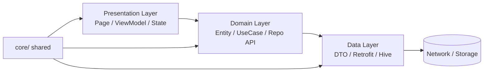

# Flutter Arms

[](https://github.com/your-org/flutter_arms/actions/workflows/ci.yml)

Flutter Arms 是一套面向**独立开发者**的 Flutter 快速开发模板，开箱可用：
**Clean Architecture + MVVM**、Riverpod 3、AutoRoute、Dio/Retrofit、Hive_ce（AES）、slang i18n、Talker 日志，并内置全局错误捕获、架构层级测试与 CI。

> **目标**：派生新项目后，无需补安全短板、无需重写错误模型、无需重新搭工程化。

## 为什么选它

- **分层不是摆设**：`test/core/architecture_test.dart` 静态强制 domain/presentation/core/features 的依赖方向，违反即测试红。
- **错误模型开箱可用**：AppException（Data 层） ↔ Failure/FailureCode（Domain/UI）双层分离，文案走 i18n，不会再硬编码中文。
- **环境隔离**：`--dart-define-from-file` + `env/*.json` + 两套 `main_*.dart` + flavor 区分。
- **运行时可观测**：`runZonedGuarded` + `FlutterError.onError` + `PlatformDispatcher.onError` + Riverpod `providerDidFail` 全线收敛；dev 环境长按 Profile 头像可查看 Talker 面板。
- **关键路径有测试**：Token 刷新、AuthGuard、Locale 持久化、Profile 页交互全部覆盖，共 60+ 用例。

## 架构分层



- **Data**：Retrofit 客户端 + Hive box + DTO↔Entity mapper。抛 `AppException` 子类。
- **Domain**：纯 Dart。Entity / Repository 接口 / UseCase。只消费 `Result<T>` 与 `Failure`。
- **Presentation**：Page + Riverpod Notifier + Freezed state。读 `context.failureMessage(failure)` 显示本地化文案。

详见 [docs/ai/ARCHITECTURE.md](docs/ai/ARCHITECTURE.md)。

## 错误流

```
 Remote/Retrofit          Repository              ViewModel/UI
  ┌──────────┐  mapper    ┌─────────────┐  .from   ┌──────────┐
  │DioError  │──────────▶│AppException │─────────▶│ Failure  │
  └──────────┘           └─────────────┘  FailureCode ────┐
                                                          ▼
                                                    t.errors.<code>
```

- Repository 内部 `_remote.xxx(body).asApi()` 保证只抛 `AppException`。
- Presentation 只认 `Failure` + `FailureCode` 枚举 + 可选 `detail`，不直接触达异常对象。
- 文案：`badResponse`/`validation` 优先使用 `detail`（后端/表单校验器提供），否则兜底 `t.errors.<code>`。

## 技术栈

| 分类 | 技术 |
|------|------|
| 状态管理 & DI | `flutter_riverpod`、`riverpod_annotation`、`riverpod_generator` |
| 路由 | `auto_route`、`auto_route_generator` |
| 网络 | `dio`、`retrofit`、`retrofit_generator`、`talker_dio_logger` |
| 模型 / 状态 | `freezed`、`json_serializable`、`build_runner` |
| 存储 | `hive_ce`、`hive_ce_flutter`（AES cipher）|
| 国际化 | `slang`、`slang_flutter`、`flutter_localizations` |
| 日志 / 可观测 | `talker`、`talker_flutter` |
| Lint / 测试 | `very_good_analysis`、`flutter_test`、`mocktail` |
| 启动资源 | `flutter_native_splash`、`flutter_launcher_icons` |

## 快速开始

### 1. 安装依赖

```bash
flutter pub get
```

### 2. 生成代码

```bash
tool/gen.sh          # = build_runner + slang
```

### 3. 配置环境

```bash
cp env/dev.example.json env/dev.json
cp env/prod.example.json env/prod.json
# 编辑真实值。env/*.json 已 gitignore。
```

### 4. 运行

```bash
tool/run_dev.sh                           # dev flavor + --dart-define-from-file=env/dev.json
tool/run_prod.sh                          # prod flavor + release 构建
```

或手动：

```bash
flutter run -t lib/main_dev.dart --flavor dev --dart-define-from-file=env/dev.json
```

### 5. 本地 CI

```bash
tool/test.sh         # flutter analyze + flutter test
tool/format.sh       # dart format --set-exit-if-changed
```

## 目录结构

```
lib/
├── app/                  # bootstrap / app_env / app_router / ProviderScope
├── core/
│   ├── error/            # AppException + Failure + FailureCode + mapper
│   ├── locale/
│   ├── logger/
│   ├── network/          # dio_client + TokenInterceptor + ApiInterceptor + dio_ext
│   ├── result/           # Result<T> + ResultX
│   ├── storage/
│   └── theme/
├── features/
│   ├── auth/             # data / domain / presentation
│   ├── home/
│   ├── onboarding/
│   └── splash/
├── shared/               # 跨 feature UI 组件
├── i18n/                 # slang 翻译源（*.i18n.json → strings.g.dart）
├── main_dev.dart
└── main_prod.dart
```

## 开发约定

- 命名：`XxxViewModel`（页面级 Notifier）、`XxxNotifier`（全局 Notifier）。
- Import 顺序：dart → package → relative。
- 公共 API 使用中文 `///` 注释。
- 优先 `const` 构造。
- 业务返回 `Result<T>`；UI 层不 `try/catch` 异常对象。
- 页面文案走 `context.t.<path>`；错误文案走 `context.failureMessage(failure)`。

## 新增 Feature

见 [docs/ai/TEMPLATE_GUIDE.md §3](docs/ai/TEMPLATE_GUIDE.md#3-新增-feature-的-checklist)。

## 安全 & 发布前 Checklist

> Hive cipher key 当前为**明文落盘**（鸿蒙兼容考量，上线前须评估）。详见 [docs/ai/SECURITY.md](docs/ai/SECURITY.md)。

## 路线图

见 [docs/ai/IMPROVEMENT_PLAN.md](docs/ai/IMPROVEMENT_PLAN.md)。

## License

MIT（默认；派生项目请按需更换）。
