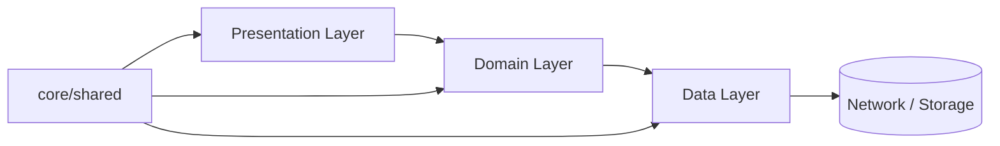
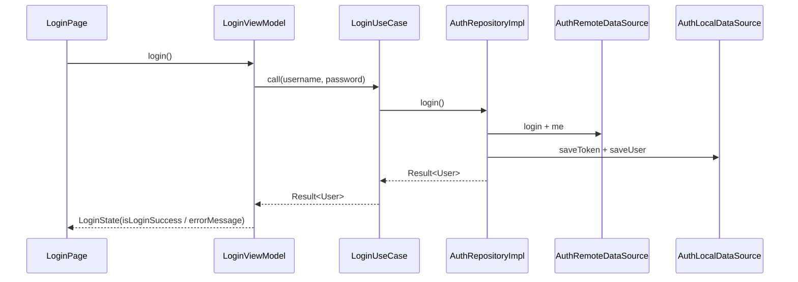

# Flutter Arms

Flutter Arms 是一个开箱即用的 Flutter 模板，基于 **Clean Architecture + MVVM**，默认支持 `dev/prod` 双环境、Riverpod 3.x、AutoRoute、Dio/Retrofit、Hive_ce 加密存储，以及运行时 i18n（`slang` + `TranslationProvider`）。

## Delivered Highlights

- `lib/features/auth/auth_providers.dart` 作为认证模块的 feature 级组合入口，Domain usecase 保持纯 Dart。
- Onboarding 使用 `PageView` 实现 swipe / skip / start 流程。
- App shell 已接入 `slang` + `TranslationProvider`，支持 `supportedLocales`、`locale` 与 `localizationsDelegates`。
- 登录、首页、启动页等关键页面文案已切换到 type-safe 翻译键。

## Architecture

- Data：网络访问、模型转换、本地缓存
- Domain：纯 Dart 业务抽象（Entity / Repository / UseCase）
- Presentation：Page + ViewModel（Riverpod Notifier）+ State





## Tech Stack

| 分类 | 技术 |
|---|---|
| 状态管理 & DI | flutter_riverpod, riverpod_annotation, riverpod_generator |
| 路由 | auto_route, auto_route_generator |
| 网络 | dio, retrofit, retrofit_generator |
| 模型/状态代码生成 | freezed, json_serializable, build_runner |
| 存储 | hive_ce, hive_ce_flutter |
| 国际化 | slang, slang_flutter, flutter_localizations |
| 日志 | talker, talker_dio_logger |
| 测试 | flutter_test, mocktail |

## Quick Start

1. 安装 Flutter 3.24+（当前项目以 3.41.x 验证）
2. 安装依赖

```bash
flutter pub get
```

3. 生成代码（路由、riverpod、freezed、json、i18n）

```bash
flutter pub run build_runner build --delete-conflicting-outputs
```

4. 运行开发环境

```bash
flutter run -t lib/main_dev.dart
```

5. 运行生产环境

```bash
flutter run -t lib/main_prod.dart
```

## Directory Structure

```text
lib/
├── app/
├── core/
├── features/
│   ├── auth/
│   ├── onboarding/
│   ├── splash/
│   └── home/
├── shared/
└── i18n/
```

## Development Conventions

- 命名：`XxxViewModel`（页面级）、`XxxNotifier`（全局级）
- Import 顺序：dart -> package -> relative
- 公共 API 使用中文 `///` 注释
- 优先 `const` 构造
- 业务返回 `Result<T>`
- 页面只消费状态并触发 ViewModel 方法
- 页面文案优先从 `context.t` 读取，避免硬编码

## New Feature Guide

1. 在 `features/<feature>` 下按 `data/domain/presentation` 分层建目录
2. Domain 先定义 `Entity + Repository + UseCase`
3. Data 实现 `Remote/Local DataSource + RepositoryImpl`
4. Presentation 实现 `State + ViewModel + Page`
5. 新增路由到 `lib/app/app_router.dart`
6. 先写测试，再实现，最后执行：

```bash
flutter analyze
flutter test
```
