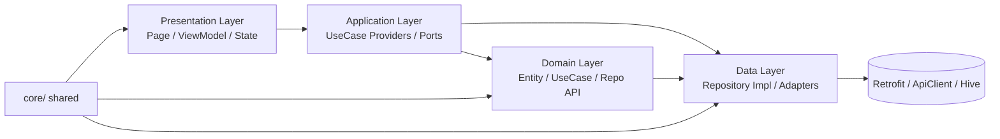

# Flutter Arms

<!-- 派生后请把 your-org/flutter_arms 替换为你自己的仓库路径 -->
[](https://github.com/your-org/flutter_arms/actions/workflows/ci.yml)

Flutter Arms 是一套面向**独立开发者**的 Flutter 快速开发模板，开箱可用：
**Clean Architecture + MVVM**、Riverpod 3、AutoRoute、Dio/Retrofit + ApiClient 对照写法、Hive_ce（AES）、slang i18n、Talker 日志，并内置全局错误捕获、架构层级测试与 CI。

> **目标**：派生新项目后，无需补安全短板、无需重写错误模型、无需重新搭工程化。

## 架构取舍

Flutter Arms 默认采用**单体仓库 + 内部分层模块化**，不默认引入 Melos。
对独立开发者来说，单 package 更容易改名、调试、运行、发布，也减少了代码生成、
依赖联动和 IDE workspace 成本。模板通过 `app/core/shared/features` 分层、
Riverpod 注入和架构测试来维持边界，而不是用 package 拆分来制造复杂度。

Melos 适合后续条件触发：同一仓库维护多个 app、`core`/`ui` 需要跨项目复用或发布、
CI 需要 package 级并行，或者 feature 已经形成稳定团队边界。没有这些信号时，
优先保持单体仓库，并只对日志、存储、网络、认证会话这类基础设施建立可替换端口。当前默认仍用 Talker、Hive、Dio/Retrofit，但业务代码通过 `AppLog`、`KvStorage`、`ApiClient`、`AuthTokenRefresher` 这些端口接入。

## 为什么选它

- **分层不是摆设**：`test/core/architecture_test.dart` 静态强制 domain/presentation/core/features 的依赖方向，违反即测试红。
- **错误模型开箱可用**：AppException（Data 层） ↔ Failure/FailureCode（Domain/UI）双层分离，文案走 i18n，不会再硬编码中文。
- **环境隔离**：`--dart-define-from-file` + `env/*.json` + 两套 `main_*.dart` + flavor 区分。
- **运行时可观测**：`runZonedGuarded` + `FlutterError.onError` + `PlatformDispatcher.onError` + Riverpod `providerDidFail` 全线收敛；dev 环境长按 Profile 头像可通过日志面板查看运行日志。
- **默认示例可以直接保留**：`features/feedback` 是产品中立的完整纵向切片，FAQ、提交反馈、历史与详情都走真实的 ViewModel → UseCase → Repository → Retrofit/Dio 链路。
- **开发演示不污染产品导航**：`features/showcase` 只在 dev 的 Profile 开发者区域与路由表中出现，用于展示 loading/toast/dialog/popup 等 UI 能力。
- **关键路径有测试**：Token 刷新、AuthGuard、Locale 持久化、反馈中心、Profile 页交互等核心链路均有单测/Widget 测覆盖。

## 架构分层


```mermaid
flowchart LR
  UI[Presentation Layer\nPage / ViewModel / State] --> AppLayer[Application Layer\nUseCase Providers / Ports]
  AppLayer --> Domain[Domain Layer\nEntity / UseCase / Repo API]
  AppLayer --> Data[Data Layer\nRepository Impl / Adapters]
  Domain --> Data
  Data --> External[(Retrofit / ApiClient / Hive)]
  Core[core/ shared] --> UI
  Core --> Domain
  Core --> Data
```

- **Application**：用例 Provider、auth/session 等组合层，隔离 presentation 和 data implementation。
- **Data**：纯 data source 接口 + Retrofit adapter + ApiClient adapter + Hive box + DTO↔Entity mapper。抛 `AppException` 子类。
- **Domain**：纯 Dart。Entity / Repository 接口 / UseCase。只消费 `Result<T>` 与 `Failure`。
- **Presentation**：Page + Riverpod Notifier + Freezed state。读取 application 暴露的 use case Provider，读 `context.failureMessage(failure)` 显示本地化文案。

详见 [docs/ai/ARCHITECTURE.md](docs/ai/ARCHITECTURE.md)。

## 错误流

```
 Remote/Retrofit          Repository              ViewModel/UI
  ┌──────────┐  mapper    ┌─────────────┐  .from   ┌──────────┐
  │DioError  │──────────▶│AppException │─────────▶│ Failure  │
  └──────────┘           └─────────────┘  FailureCode ────┐
                                                          ▼
                                                    t.errors.<code>
```

- Repository 内部 `_remote.xxx(body).asApi()` 保证只抛 `AppException`。
- Presentation 只认 `Failure` + `FailureCode` 枚举 + 可选 `detail`，不直接触达异常对象。
- 文案：`badResponse`/`validation` 优先使用 `detail`（后端/表单校验器提供），否则兜底 `t.errors.<code>`。

## 技术栈

| 分类 | 技术 |
|------|------|
| 状态管理 & DI | `flutter_riverpod`、`riverpod_annotation`、`riverpod_generator` |
| 路由 | `auto_route`、`auto_route_generator` |
| 网络 | `dio`、`retrofit`、`retrofit_generator`、`ApiClient`/`ApiRequest` 端口、`talker_dio_logger` |
| 模型 / 状态 | `freezed`、`json_serializable`、`build_runner` |
| 存储 | `hive_ce`、`hive_ce_flutter`（AES cipher）|
| 国际化 | `slang`、`slang_flutter`、`flutter_localizations` |
| 屏幕适配 | `screen_size_adapter`（binding 级设计尺寸适配，默认 `360 × 690`）|
| 全局 UI 反馈 | `super_overlay`（toast / loading / popup / notify）|
| 日志 / 可观测 | `talker`、`talker_flutter` |
| Lint / 测试 | `very_good_analysis`、`flutter_test`、`mocktail` |
| 启动资源 | `flutter_native_splash`、`flutter_launcher_icons` |

## 从模板派生新项目

### Step 1 — 克隆并断开与模板仓库的关联

```bash
# 浅克隆（只拿最新一次提交，省带宽）
git clone --depth 1 https://github.com/your-org/flutter_arms.git my_app
cd my_app

# 丢掉模板的 git 历史，作为全新项目重新初始化
rm -rf .git
git init -b main
git add . && git commit -m "chore: bootstrap from flutter_arms"

# 如已在 GitHub 建好空仓库，关联即可
# git remote add origin git@github.com:<you>/my_app.git
# git push -u origin main
```

> 想保留模板历史？改用 `git remote rename origin upstream` + `git remote add origin <new>`。

### Step 2 — 一键改名

运行 [tool/rename.dart](tool/rename.dart)。脚本只依赖 Dart SDK，在 **macOS / Linux / Windows（PowerShell 或 cmd）** 上命令完全一致：

```bash
dart tool/rename.dart \
  --name my_app \
  --package com.example.my_app \
  --display "My App"
```

省略任意参数即进入交互式提问。可选的 `--ios-bundle-id` 默认从 `--package` 自动推导（`com.example.my_app` → `com.example.myApp`，规避 iOS 不允许下划线的限制）。

覆盖范围：

| 层级     | 修改项                                                                                          |
| -------- | ---------------------------------------------------------------------------------------------- |
| Dart     | `pubspec.yaml` 的 `name`；`lib/` 与 `test/` 下所有 `package:flutter_arms/` 引用                  |
| Android  | `applicationId` / `namespace`；Kotlin 目录搬家 + `MainActivity.kt` 包声明；`android:label`       |
| iOS      | `project.pbxproj` 的 `PRODUCT_BUNDLE_IDENTIFIER`（含 RunnerTests）；`Info.plist` 显示名          |
| macOS    | `AppInfo.xcconfig`（PRODUCT_NAME / BUNDLE_IDENTIFIER / COPYRIGHT）+ pbxproj + `Info.plist`      |
| Linux    | `linux/CMakeLists.txt` 的 `BINARY_NAME` / `APPLICATION_ID`                                     |
| Windows  | `windows/CMakeLists.txt`、窗口标题、`Runner.rc` 版本元数据                                      |
| Web      | `web/index.html` 的 `<title>` / apple-mobile-web-app-title；`web/manifest.json` 名称            |

脚本特性：

- **幂等**：同参数重跑 no-op；检测到 pubspec 已改成别的名字会直接拒绝，避免把已派生的项目二次破坏。
- **不破坏重叠前缀**：Kotlin 目录只 `rmdir`（非空目录会失败），所以 `com.indiegeeker.flutter_arms → com.indiegeeker.my_app` 这种共享前缀场景也安全。
- **只依赖 Dart SDK**：不依赖 `sed` / `PlistBuddy` / `bash`，Windows 原生可跑。

### Step 3 — 替换品牌资源 + 重新生成

```bash
# 图标 + 启动屏
# assets/icon/app_icon.png  → 1024×1024 新图标
# assets/splash/logo.png     → 启动屏 Logo（透明 PNG）
dart run flutter_launcher_icons
dart run flutter_native_splash:create

# 清理 + 重新生成代码 + 跑一遍测试
flutter clean
flutter pub get
tool/gen.sh                # build_runner + slang
tool/test.sh               # analyze + test
flutter run -t lib/main_dev.dart --flavor dev
```

> iOS 代码签名：Bundle ID 改了以后需在 Xcode 的 Signing & Capabilities 面板重新匹配 Provisioning Profile。

更细的派生 checklist（Mock API、安全短板等）见 [docs/ai/TEMPLATE_GUIDE.md §1](docs/ai/TEMPLATE_GUIDE.md#1-一次性改名派生时)。

### Step 4 — 决定默认功能边界

- **建议保留 `features/feedback`**：它是面向真实产品的默认功能，不是需要每次 clone 后删除的业务占位页。接入后端时只需实现文档约定的 `/feedback/*` 接口。
- **按需删除 `features/showcase`**：它是 dev-only Developer Lab，生产路由不会注册。派生项目完成基础能力验收后可删除，不影响反馈中心或其它业务。
- 默认底部导航只有 **Home + Profile**。Home 是产品扩展点；FAQ 搜索位于反馈中心内部，不占用全局 Search Tab。

## 快速开始

### 1. 安装依赖

```bash
flutter pub get
```

### 2. 生成代码

```bash
tool/gen.sh          # = build_runner + slang
```

### 3. 配置环境

```bash
cp env/dev.example.json env/dev.json
cp env/prod.example.json env/prod.json
# 编辑真实值。env/*.json 已 gitignore。
```

### 4. 运行

```bash
tool/run_dev.sh                           # dev flavor + --dart-define-from-file=env/dev.json
tool/run_prod.sh                          # prod flavor + release 构建
```

或手动：

```bash
flutter run -t lib/main_dev.dart --flavor dev --dart-define-from-file=env/dev.json
```

### 5. 本地 CI

```bash
tool/test.sh         # flutter analyze + flutter test
tool/format.sh       # dart format --set-exit-if-changed
```

## 目录结构

```
lib/
├── app/                  # bootstrap / app_env / app_router / ProviderScope
├── core/
│   ├── error/            # AppException + Failure + FailureCode + mapper
│   ├── locale/
│   ├── logger/
│   ├── auth/             # AuthTokenRefresher 端口
│   ├── network/          # ApiClient/ApiRequest + Dio adapter + TokenInterceptor
│   ├── result/           # Result<T> + ResultX
│   ├── storage/
│   └── theme/
├── features/
│   ├── auth/             # application / data / domain / presentation
│   ├── feedback/         # 默认启用：FAQ / 提交 / 历史 / 详情完整纵向切片
│   ├── home/             # Home + Profile 两个顶层 Tab
│   ├── onboarding/
│   ├── showcase/         # dev-only Developer Lab，派生项目可删
│   └── splash/
├── shared/               # 跨 feature UI 组件与反馈门面
├── i18n/                 # slang 翻译源（*.i18n.json → strings.g.dart）
├── main_dev.dart
└── main_prod.dart
```

## 开发约定

- 命名：`XxxViewModel`（页面级 Notifier）、`XxxNotifier`（全局 Notifier）。
- Import 顺序：dart → package → relative。
- 公共 API 使用中文 `///` 注释。
- 优先 `const` 构造。
- 业务返回 `Result<T>`；UI 层不 `try/catch` 异常对象。
- 页面文案走 `context.t.<path>`；错误文案走 `context.failureMessage(failure)`。

## 新增 Feature

见 [docs/ai/TEMPLATE_GUIDE.md §3](docs/ai/TEMPLATE_GUIDE.md#3-新增-feature-的-checklist)。

## 安全 & 发布前 Checklist

> Hive cipher key 当前为**明文落盘**（鸿蒙兼容考量，上线前须评估）。详见 [docs/ai/SECURITY.md](docs/ai/SECURITY.md)。

## 路线图

见 [docs/ai/IMPROVEMENT_PLAN.md](docs/ai/IMPROVEMENT_PLAN.md)。

## License

MIT（默认；派生项目请按需更换）。
