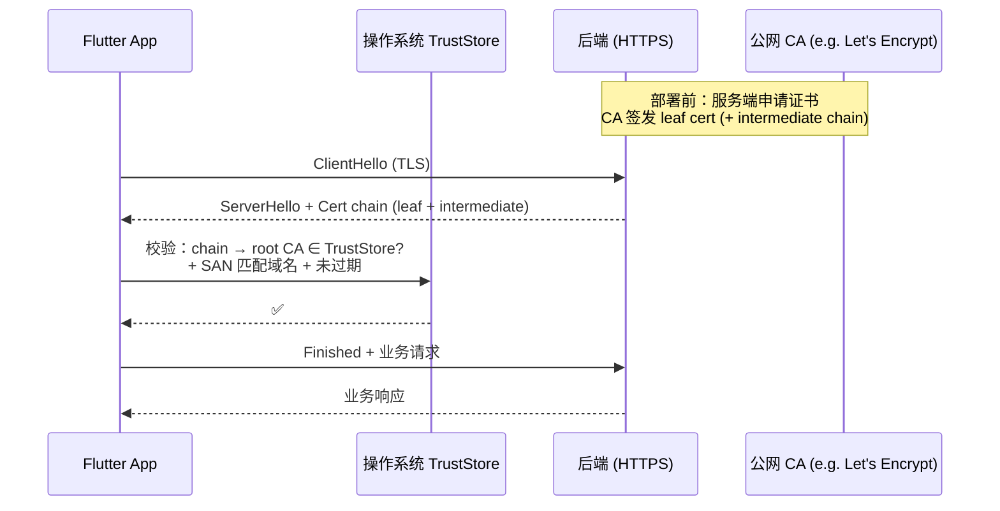
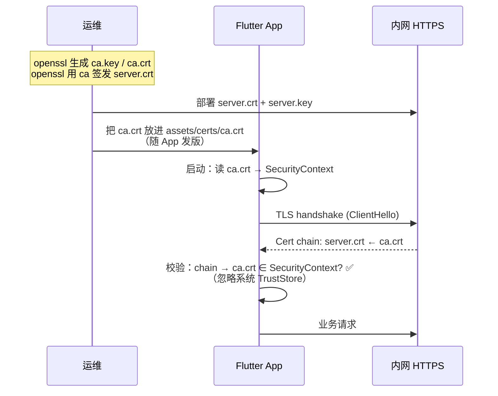
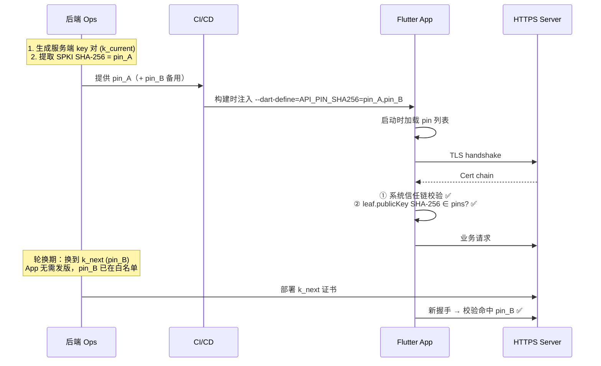
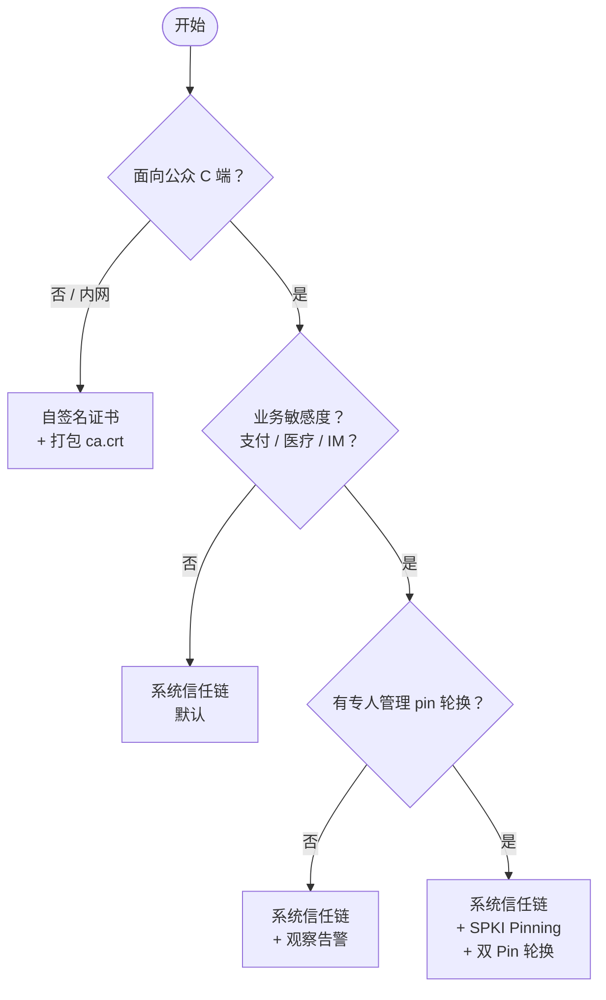

# Flutter HTTPS 证书配置指南

> 最后更新：2026-04-18
> 定位：Flutter Arms 模板的 HTTPS 拓展章节。覆盖**系统信任链 / 自签名证书 / 证书钉扎**三种常见方式的原理、优缺点、使用场景、前后端交互流程与代码示例。

---

## 0. 速查

| 方式 | 信任来源 | 防抓包 | 配置成本 | 适用 |
|------|----------|--------|----------|------|
| 系统信任链（默认） | 设备内置 CA 根 | ❌ | 无 | 绝大多数 C 端 App |
| 自签名证书 | 自备 CA，客户端白名单 | 中 | 中 | 内网 / 开发 / 测试 / 企业 App |
| 证书钉扎（Pinning） | 内置公钥/证书指纹 | ✅ | 高 | 金融 / 医疗 / IM / 高安全 |

**不互斥**：生产经常"**系统信任链 + Pinning**"叠加，开发阶段再通过 flavor 开关切到"**自签名容忍**"。

---

## 1. 方式一：系统信任链（默认）

### 1.1 原理
- Dio 底层走 `dart:io` 的 `HttpClient`，由操作系统提供证书校验：iOS → Secure Transport（Keychain 根 CA），Android → `NetworkSecurityConfig`（系统根 CA 列表）。
- 客户端对服务端证书链做常规校验：**签发 CA 在系统根信任列表** + **域名匹配** + **未过期** + **未吊销**。

### 1.2 优缺点
| 优点 | 缺点 |
|------|------|
| 零配置 | 任何被系统信任的 CA 签发的证书都能顶替你的服务端（抓包代理、运营商劫持、被入侵 CA） |
| 证书续签零感知 | Android 7+ 默认不再信任用户安装的 CA（需 `networkSecurityConfig` 放开才能抓包调试，这恰好是"缺点"也是"优点"）|
| 运维成本低 | 不防中间人攻击（MITM）|

### 1.3 使用场景
- **C 端产品**、低敏感业务（资讯、工具、社区、博客）。
- 后端 API 使用公网 CA（Let's Encrypt、DigiCert、ACME.sh 自动签发）。
- 不需要对抗 Charles/mitmproxy 之类的调试代理（或调试代理反而是必需的）。

### 1.4 前后端交互流程



### 1.5 代码示例（本模板当前状态）
Dio 默认就走系统信任链，**不需要改任何代码**：

```dart
// lib/core/network/dio_client.dart 节选
@Riverpod(keepAlive: true)
Dio dio(Ref ref) {
  final env = ref.read(appEnvProvider);
  final dio = Dio(BaseOptions(
    baseUrl: env.baseUrl,           // https://api.example.com
    connectTimeout: const Duration(seconds: 15),
  ));
  // 不需要任何 httpClientAdapter 定制。
  return dio;
}
```

**只需保证**：`env/prod.json` 里 `API_BASE_URL` 是 `https://...`，服务端证书由公网 CA 签发。

---

## 2. 方式二：自签名证书

### 2.1 原理
- 自己扮演 CA：用 `openssl` 生成一张根 CA 证书（`ca.crt`），再用它签发服务端 leaf 证书（`server.crt`）。
- 客户端**默认不信任**这张自签 CA（因为不在系统根信任列表）。两条路径：
  1. **A. 白名单注入**：把 `ca.crt` 打进 App assets，启动时加载到 `SecurityContext`。
  2. **B. 回调放行**（仅 dev 推荐）：`badCertificateCallback` 对指定 host 返回 `true`。

### 2.2 优缺点

| 优点 | 缺点 |
|------|------|
| 无需花钱买证书 / 无需公网 CA | CA 私钥一旦泄露，整条链都要重签 |
| 可控：签发策略、有效期、SAN 完全自定义 | 证书轮换需要客户端同步更新 assets（发版成本）|
| 天然"隐式 Pinning"（只信自家 CA）| 不适合面向公众分发的 App（客户无法正确配置信任）|
| 开发环境可配抓包代理 | 一旦启用就不能用公网 CA 了（除非叠加多信任源）|

### 2.3 使用场景
- **企业内网 App**（OA、工单、运维）。
- **开发环境 / 预发环境**：后端还没上公网证书，或要 mock 一个 HTTPS 服务。
- **物联网 / 本地局域网设备通信**（如配网场景与路由器通信）。
- **测试环境用 mitmproxy 抓包**：把 mitmproxy 的 `mitmproxy-ca-cert.pem` 当自签 CA 注入。

### 2.4 前后端交互流程



### 2.5 代码示例

#### 2.5.1 方案 A：Assets 注入 CA（生产可用）

**步骤**：
```bash
# 1. 把 CA 证书放到 assets
mkdir -p assets/certs
cp /path/to/ca.crt assets/certs/ca.crt
```

```yaml
# 2. pubspec.yaml 声明资产
flutter:
  assets:
    - assets/certs/ca.crt
```

```dart
// 3. lib/core/network/dio_client.dart
import 'dart:io';
import 'package:dio/dio.dart';
import 'package:dio/io.dart';
import 'package:flutter/services.dart';

@Riverpod(keepAlive: true)
Future<Dio> selfSignedDio(Ref ref) async {
  final env = ref.read(appEnvProvider);
  final caBytes = await rootBundle.load('assets/certs/ca.crt');
  final ctx = SecurityContext(withTrustedRoots: false) // 关键：不叠加系统根
    ..setTrustedCertificatesBytes(caBytes.buffer.asUint8List());

  final dio = Dio(BaseOptions(baseUrl: env.baseUrl))
    ..httpClientAdapter = IOHttpClientAdapter(
      createHttpClient: () => HttpClient(context: ctx),
    );
  return dio;
}
```

> `withTrustedRoots: false` 是安全最佳实践：只信自家 CA。如果后端同时要访问公网域名（比如第三方 OSS），请用 `withTrustedRoots: true` 叠加，或拆分不同的 Dio 实例。

#### 2.5.2 方案 B：`badCertificateCallback` 放行（**仅 dev，严禁生产**）

```dart
@Riverpod(keepAlive: true)
Dio insecureDevDio(Ref ref) {
  final env = ref.read(appEnvProvider);
  assert(
    env.flavor == AppFlavor.dev,
    'insecureDevDio must not be used in production.',
  );

  final dio = Dio(BaseOptions(baseUrl: env.baseUrl))
    ..httpClientAdapter = IOHttpClientAdapter(
      createHttpClient: () {
        final c = HttpClient();
        c.badCertificateCallback = (cert, host, port) {
          // 仅对我们自己的 host 放行，避免把整台代理都敞开
          const allowedHosts = {'localhost', '10.0.2.2', 'dev.internal'};
          return allowedHosts.contains(host);
        };
        return c;
      },
    );
  return dio;
}
```

> **危险提示**：`badCertificateCallback` 返回 `true` 等于"**我不检查证书了**"，一旦误发到生产 flavor，整条业务链都是裸奔。务必用 `assert + flavor` 双重兜底，并在 CI 中加 grep 检查。

#### 2.5.3 Android 补充（用户安装的 CA）
Android 7+ 默认不信任用户 CA。如果**不想**把 CA 打进 App，而是通过 MDM 让用户手动安装，需要在 `android/app/src/main/res/xml/network_security_config.xml`：

```xml
<?xml version="1.0" encoding="utf-8"?>
<network-security-config>
  <domain-config>
    <domain includeSubdomains="true">dev.internal</domain>
    <trust-anchors>
      <certificates src="user"/>
      <certificates src="system"/>
    </trust-anchors>
  </domain-config>
</network-security-config>
```

并在 `AndroidManifest.xml`：
```xml
<application android:networkSecurityConfig="@xml/network_security_config" ...>
```

---

## 3. 方式三：证书钉扎（Certificate Pinning）

### 3.1 原理
在客户端内置服务端**证书或公钥的指纹**（通常是 SHA-256）。TLS 握手拿到证书后，**除了**系统信任链校验，**再多做一步**：把实际指纹和白名单对比，不一致就拒绝连接。

| 钉什么 | 指纹对象 | 轮换成本 | 推荐度 |
|--------|----------|----------|--------|
| Leaf 证书 | 服务端当前证书本身 | 每次续签都要发版 | ❌ |
| Intermediate 证书 | 中间 CA 证书 | CA 更换中间证书会翻车 | ❌ |
| **SPKI**（Subject Public Key Info） | 公钥（不含签名、有效期）| 只要 key 不换就不用发版 | ✅ **推荐** |

**双 Pin 轮换策略**：白名单同时放当前 key + 下一把 key 的 SHA-256。切换期只改服务端，不用发 App。

### 3.2 优缺点

| 优点 | 缺点 |
|------|------|
| 抵御抓包代理、运营商劫持、被入侵 CA 签发伪证 | 忘记更新 Pin 会导致**全员白屏**，线上无法远程修复 |
| 关键业务（支付、登录）安全上一个等级 | 实现复杂，要做监控、回滚、灰度 |
| 叠加系统信任链，不是替代 | 越狱 / Frida hook 依然能绕过（移动端安全天花板）|

### 3.3 使用场景
- **金融 / 证券 / 银行**（支付、转账接口）。
- **医疗 / 健康**（病历、检验单）。
- **IM / E2E 通信的控制面**（会话密钥协商接口）。
- **严格合规要求**（等保三级以上、PCI-DSS）。
- **不适合**：快速迭代的 C 端产品，或后端用 Let's Encrypt 90 天轮换的团队（除非你真的会管理 Pin）。

### 3.4 前后端交互流程



### 3.5 代码示例

#### 3.5.1 提取 SPKI SHA-256（运维侧）

```bash
# 从服务端证书（或 key）提取 SPKI SHA-256
openssl s_client -connect api.example.com:443 -servername api.example.com < /dev/null 2>/dev/null \
  | openssl x509 -pubkey -noout \
  | openssl pkey -pubin -outform der \
  | openssl dgst -sha256 -binary \
  | openssl enc -base64

# 输出形如：g4nDxQnWZA2eXKvOx0oe+NlE/i5S9dHRkSHzMSlbjz8=
```

把**当前**和**下一把**key 的 SHA-256 都写入 `env/prod.json`：

```json
{
  "APP_NAME": "Flutter Arms",
  "API_BASE_URL": "https://api.example.com",
  "ENABLE_LOG": false,
  "API_PIN_SHA256": "g4nDxQnWZA2eXKvOx0oe+NlE/i5S9dHRkSHzMSlbjz8=,Z3Yk6DF5q7VxS+pmf8kf3pGFrB3zhDxMkA9tQy4Qz+w="
}
```

#### 3.5.2 AppEnv 读取 pin 列表

```dart
// lib/app/app_env.dart 扩展
class AppEnv {
  // ...既有字段
  final List<String> apiPinSha256;

  const AppEnv({
    // ...
    this.apiPinSha256 = const [],
  });

  factory AppEnv.fromFlavor(AppFlavor flavor) {
    const envPins = String.fromEnvironment('API_PIN_SHA256');
    final pins = envPins.isEmpty
        ? const <String>[]
        : envPins.split(',').map((e) => e.trim()).toList();
    // ... 其它字段
    return AppEnv(
      // ...
      apiPinSha256: pins,
    );
  }
}
```

#### 3.5.3 Pinning 拦截器（SPKI 方案）

```dart
// lib/core/network/pinning.dart
import 'dart:convert';
import 'dart:io';
import 'package:crypto/crypto.dart';
import 'package:dio/io.dart';

/// 把一组 SPKI SHA-256（base64）指纹绑定到 HttpClient 上。
/// 握手阶段若指纹不在白名单，则 Dio 抛出 HandshakeException。
HttpClient pinnedHttpClient(List<String> pinsBase64) {
  if (pinsBase64.isEmpty) return HttpClient();

  final allowed = pinsBase64.toSet();
  final client = HttpClient()
    ..badCertificateCallback = (cert, host, port) {
      // 系统信任链已过 → 此处仅当系统校验失败时触发；
      // Pinning 逻辑放在下面 connectionFactory，而不是在这里放行。
      return false;
    };
  // dart:io 没有直接暴露握手证书公钥，所以我们在 "证书通过系统校验后"
  // 用 cert.der 里的 SubjectPublicKeyInfo 做 SHA-256。
  // 实现：重写 badCertificateCallback + 读取 cert。
  // 但 dart:io 只在"系统校验失败"时调 badCertificateCallback，
  // 所以真正的 pinning 要包在响应拦截里。详见 3.5.4。
  return client;
}
```

> **注意**：`dart:io` 的 `HttpClient.badCertificateCallback` 只在系统校验**失败**时触发，不适合做"再加一道"钉扎。Flutter 社区通用做法是：**用拦截器在握手后读 leaf 证书做 SPKI 比对**。

#### 3.5.4 推荐实现：Dio 拦截器 + `cronet`/原生通道（或使用成熟库）

纯 `dart:io` 实现起来很曲折。**生产项目强烈建议用现成库**：

**选项 1：`http_certificate_pinning`**（活跃维护，iOS/Android 原生实现）

```yaml
dependencies:
  http_certificate_pinning: ^3.0.0
```

```dart
// lib/core/network/pinning_interceptor.dart
import 'package:dio/dio.dart';
import 'package:http_certificate_pinning/http_certificate_pinning.dart';

class PinningInterceptor extends Interceptor {
  PinningInterceptor(this.pins);
  final List<String> pins;

  @override
  Future<void> onRequest(
    RequestOptions options,
    RequestInterceptorHandler handler,
  ) async {
    if (pins.isEmpty) return handler.next(options);
    try {
      await HttpCertificatePinning.check(
        serverURL: '${options.uri.scheme}://${options.uri.host}',
        headerHttp: const {},
        sha: SHA.SHA256,
        allowedSHAFingerprints: pins,
        timeout: 30,
      );
      handler.next(options);
    } on Object catch (e, s) {
      handler.reject(DioException(
        requestOptions: options,
        type: DioExceptionType.badCertificate,
        error: e,
        stackTrace: s,
        message: 'Certificate pinning failed',
      ));
    }
  }
}
```

**选项 2：仅 Dart 侧，自行读 cert.der 做 SPKI hash**（依赖 `IOHttpClientAdapter.validateCertificate`）：

```dart
// dio ^5.4 起支持 validateCertificate
dio.httpClientAdapter = IOHttpClientAdapter(
  validateCertificate: (cert, host, port) {
    if (cert == null) return false;
    // 系统链若已通过，这里只做 Pinning。
    // 提取 SPKI（需额外解析 DER；简单场景可退而求其次：对整个证书哈希）
    final fingerprint = base64.encode(
      sha256.convert(cert.der).bytes,
    );
    return allowedPins.contains(fingerprint);
  },
);
```

> ⚠️ 对**整个证书**哈希（非 SPKI）意味着证书续签就要发版，除非你签发时主动复用同一张 leaf（不推荐）。严肃场景仍建议用 SPKI。

#### 3.5.5 接入到本模板

```dart
// lib/core/network/dio_client.dart
@Riverpod(keepAlive: true)
Dio dio(Ref ref) {
  final env = ref.read(appEnvProvider);
  final logger = ref.read(appLoggerProvider);
  final storage = ref.read(kvStorageProvider);

  final dio = Dio(_baseOptions(env.baseUrl));

  dio.interceptors
    ..add(TalkerDioLogger(talker: logger))
    ..add(TokenInterceptor(...))
    ..add(const ApiInterceptor())
    ..addAll([
      if (env.apiPinSha256.isNotEmpty)
        PinningInterceptor(env.apiPinSha256),
    ]);

  return dio;
}
```

#### 3.5.6 测试

```dart
// test/core/network/pinning_interceptor_test.dart
test('rejects when fingerprint is not in allow-list', () async {
  final interceptor = PinningInterceptor(const ['NOT_THE_REAL_PIN']);
  final handler = _CapturingHandler();
  await interceptor.onRequest(
    RequestOptions(path: 'https://api.example.com/users'),
    handler,
  );
  expect(handler.rejected, isTrue);
  expect(handler.rejection?.type, DioExceptionType.badCertificate);
});
```

---

## 4. 三种方式对比矩阵

| 维度 | 系统信任链 | 自签名证书 | 证书钉扎 |
|------|------------|------------|----------|
| 证书来源 | 公网 CA | 自建 CA | 任意（只认指纹）|
| 防中间人代理 | ❌ | 中（仅信任自家 CA） | ✅ |
| 防被入侵 CA 伪造 | ❌ | ✅ | ✅ |
| 证书续签影响客户端 | 无 | 仅 CA 换才要发版 | SPKI 不换 key 则无；换 key 要发版（或双 Pin 轮换） |
| 配置成本 | 0 | 中（打包 ca.crt）| 高（pin 管理 + 轮换流程） |
| 翻车后果 | 无 | 连接失败、可通过更新 App 恢复 | **全员白屏**、必须灰度回滚 |
| 远程修复能力 | N/A | 通过后端改 CA | **无**（硬编码在 App）|
| 适合 App 类型 | 大众 C 端 | 内网 / 企业 / 开发 | 金融 / 医疗 / IM |
| 调试工具（Charles 等） | 可抓包（安装代理 CA） | 取决于实现 | 无法抓包（符合预期） |

---

## 5. 选型决策流程



---

## 6. 前后端协同 Checklist

### 6.1 服务端（运维）
- [ ] 证书链完整（leaf + intermediate），`ssllabs.com/ssltest` ≥ A。
- [ ] 关闭 TLS 1.0/1.1，只开 TLS 1.2+（最好 1.3）。
- [ ] HSTS 头已配置。
- [ ] 如果用 Pinning：维护 pin 轮换 SOP（至少 2 个 key 常备，灰度 → 全量 → 下线旧 pin）。
- [ ] 告警：TLS handshake 失败率突增时通知客户端团队。

### 6.2 客户端（Flutter）
- [ ] 生产 `env/prod.json` 的 `API_BASE_URL` 是 HTTPS。
- [ ] 生产构建不含 `badCertificateCallback = (_, __, ___) => true` 这种全放行代码（可用 `grep -r 'badCertificateCallback' lib/` 在 CI 中检查）。
- [ ] 若启用 Pinning：
  - [ ] Pin 来自 `--dart-define`，不硬编码在 Dart 源码里。
  - [ ] 同时白名单 2 个 pin。
  - [ ] 有"pin 检查失败"的专门 `FailureCode`，UI 层给出引导（"请更新 App" / "网络环境不安全"）。
  - [ ] 灰度发版：第一版先 dry-run 模式只打日志不拒绝，观察 7 天再切硬拒绝。

### 6.3 双方协同
- [ ] 发版窗口对齐：轮换 pin 的那一次服务端变更**前**，客户端新版本必须已覆盖 ≥ 95% DAU。
- [ ] 事故预案：pin 误配置导致白屏时，通过后端下发"强制更新"弹窗版本（由 env api、而不是受 pin 保护的业务 api）远程指引用户升级。

---

## 7. 常见坑

| # | 现象 | 根因 | 对策 |
|---|------|------|------|
| 1 | iOS 能连、Android 不能连 | Android 7+ 不信任用户安装的 CA | `network_security_config.xml` 放开用户 CA，或改用方案 A（assets 注入）|
| 2 | 升级后大面积握手失败 | Pin 忘记换 / 后端证书换了新 key | 立即灰度回滚；紧急版本 pin 加新指纹 |
| 3 | Release 能连、debug 不能连 | `SecurityContext` 里 `withTrustedRoots: false` 把公网 CA 也排除了 | 改 `true`，或把公网 CA 也装入 SecurityContext |
| 4 | 抓包抓不到 | Pinning 正常工作 ✅ | dev flavor 走单独的 dio（不加 pin 拦截器）|
| 5 | `HandshakeException: Connection terminated during handshake` | 证书链不完整（只给 leaf、没给 intermediate）| 服务端 nginx `ssl_certificate` 用 `fullchain.pem` |
| 6 | 自签 CA 生产了无意叠加系统根 | 默认 `SecurityContext()` 带 `withTrustedRoots: true` | 显式 `withTrustedRoots: false` |
| 7 | `badCertificateCallback` 看起来不触发 | 它只在系统校验失败时调用，成功时不会 | 要"再加一道"校验请走 `validateCertificate` / 拦截器 |
| 8 | Flutter Web 不生效 | 浏览器环境用的是浏览器 trust store，`IOHttpClientAdapter` 不生效 | Web 目标只能走系统信任链 + CORS |

---

## 8. 参考
- [Dart: `SecurityContext`](https://api.dart.dev/stable/dart-io/SecurityContext-class.html)
- [Dart: `HttpClient.badCertificateCallback`](https://api.dart.dev/stable/dart-io/HttpClient/badCertificateCallback.html)
- [Dio: `IOHttpClientAdapter.validateCertificate`](https://pub.dev/packages/dio)
- [OWASP Mobile: Certificate Pinning](https://owasp.org/www-community/controls/Certificate_and_Public_Key_Pinning)
- [Android Network Security Config](https://developer.android.com/training/articles/security-config)
- [`http_certificate_pinning`](https://pub.dev/packages/http_certificate_pinning)
