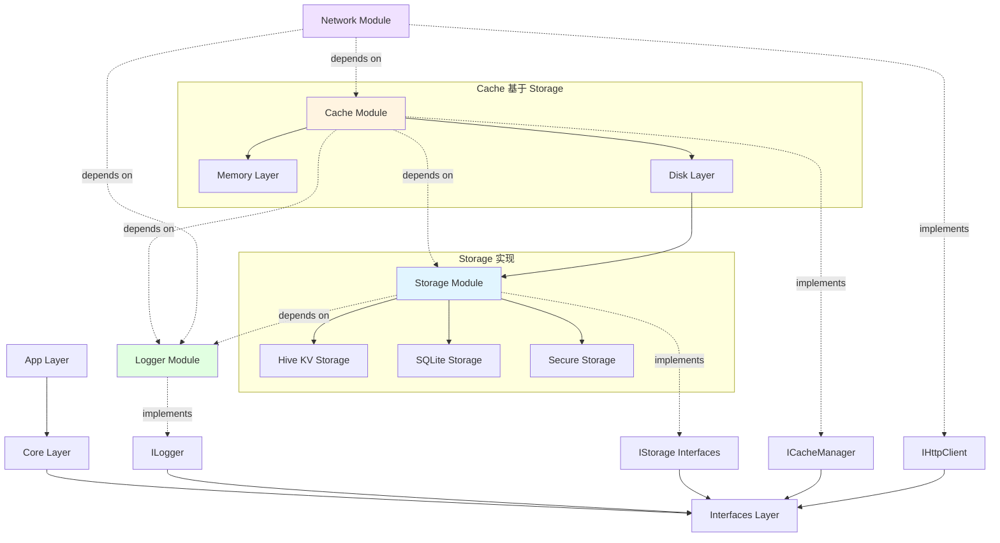
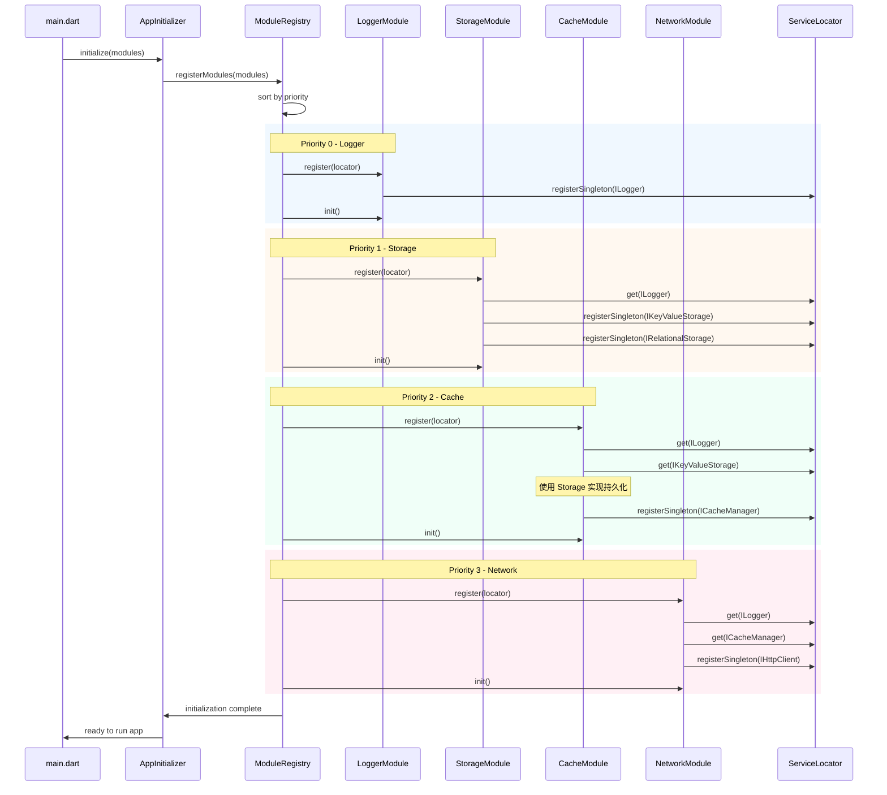

# FlutterArms 架构设计文档

> **版本**: 2.0 (Revised)
> **更新时间**: 2025-11-07
> **作者**: Claude Code

## 版本修订说明

**v2.0 重要修订**：重新梳理了 Storage 和 Cache 的职责边界

- **问题**：原设计中 Hive 等数据库被错误归类为缓存，Storage 和 Cache 职责重叠
- **解决方案**：
  - Storage 作为底层持久化存储抽象（KV/文档/关系型/安全存储）
  - Cache 作为上层性能优化层（内存+磁盘多级缓存，基于 Storage 实现持久化）
  - 明确依赖关系：Cache 依赖 Storage，复用其持久化能力

---

## 目录

- [1. 架构概述](#1-架构概述)
- [2. 接口层 (Interfaces)](#2-接口层-interfaces)
- [3. 核心层 (Core)](#3-核心层-core)
- [4. 日志模块 (Logger Module)](#4-日志模块-logger-module)
- [5. 存储模块 (Storage Module)](#5-存储模块-storage-module)
- [6. 缓存模块 (Cache Module)](#6-缓存模块-cache-module)
- [7. 网络模块 (Network Module)](#7-网络模块-network-module)
- [8. 模块依赖关系与注册顺序](#8-模块依赖关系与注册顺序)
- [9. 完整目录结构](#9-完整目录结构)
- [10. 依赖关系图](#10-依赖关系图)

---

## 1. 架构概述

FlutterArms 采用 **Clean Architecture** 设计，遵循 **SOLID** 原则和 **插件化** 架构模式。

### 架构分层

```
┌─────────────────────────────────────────┐
│          App Layer (应用层)              │
│   - UI Components                       │
│   - Business Logic                      │
└─────────────────────────────────────────┘
                  ↓ 依赖
┌─────────────────────────────────────────┐
│        Core Layer (聚合协调层)           │
│   - Dependency Registration             │
│   - Module Initialization               │
│   - Unified API                         │
└─────────────────────────────────────────┘
                  ↓ 依赖
┌─────────────────────────────────────────┐
│     Interfaces Layer (抽象定义层)        │
│   - Storage Interface (底层)            │
│   - Cache Interface (上层优化)          │
│   - Network Interface                   │
│   - Logger Interface                    │
└─────────────────────────────────────────┘
                  ↑ 实现
┌─────────────────────────────────────────┐
│    Modules Layer (基础设施实现层)        │
│   - Storage: Hive/SQLite/SecureStorage  │
│   - Cache: Multi-Level Cache            │
│   - Network: Dio                        │
│   - Logger: Logger Package              │
└─────────────────────────────────────────┘
```

### Storage vs Cache 职责划分

```
┌──────────────────────────────────────────┐
│      Cache Layer (缓存层 - 上层优化)      │
│  - 临时数据存储                           │
│  - 自动过期清理                           │
│  - LRU/LFU 淘汰策略                       │
│  - 内存 + 磁盘多级缓存                    │
└──────────────────────────────────────────┘
              ↓ 依赖（用于持久化）
┌──────────────────────────────────────────┐
│    Storage Layer (存储层 - 底层基础)      │
│  - 持久化数据存储                         │
│  - 业务数据管理                           │
│  - 无自动过期                             │
│  - KV/文档/关系型/安全存储                │
└──────────────────────────────────────────┘
```

**关键设计决策**：
- ✅ Storage 是底层基础设施，提供数据持久化能力
- ✅ Cache 是上层性能优化，基于 Storage 实现可选的磁盘缓存
- ✅ Hive、SQLite 等数据库属于 Storage，不是 Cache
- ✅ Cache 通过依赖注入使用 Storage 接口

### 设计原则

- **依赖倒置**: 上层依赖接口，不依赖具体实现
- **接口隔离**: 每个功能模块有独立的接口定义
- **单一职责**: 每个模块只负责一个功能领域
- **开闭原则**: 对扩展开放，对修改封闭
- **可替换性**: 实现层可随时替换，不影响上层

---

## 2. 接口层 (Interfaces)

### 2.1 包信息

**包名**: `interfaces`
**路径**: `packages/interfaces/`
**职责**: 定义所有基础设施模块的抽象接口

### 2.2 目录结构

```
packages/interfaces/
├── lib/
│   ├── interfaces.dart              # 统一导出文件
│   │
│   ├── storage/                     # 存储接口（底层基础设施）
│   │   ├── i_storage.dart           # 存储基类
│   │   ├── i_kv_storage.dart        # KV 存储接口
│   │   ├── i_document_storage.dart  # 文档存储接口
│   │   ├── i_relational_storage.dart# 关系型存储接口
│   │   ├── i_secure_storage.dart    # 安全存储接口
│   │   └── storage_exception.dart   # 存储异常定义
│   │
│   ├── cache/                       # 缓存接口（上层性能优化）
│   │   ├── i_cache_manager.dart     # 缓存管理器接口
│   │   ├── cache_policy.dart        # 缓存策略枚举
│   │   └── cache_stats.dart         # 缓存统计模型
│   │
│   ├── network/                     # 网络接口
│   │   ├── i_http_client.dart       # HTTP 客户端接口
│   │   ├── i_network_interceptor.dart # 网络拦截器接口
│   │   ├── network_request.dart     # 请求数据模型
│   │   ├── network_response.dart    # 响应数据模型
│   │   └── network_exception.dart   # 网络异常定义
│   │
│   └── logger/                      # 日志接口
│       ├── i_logger.dart            # 日志接口
│       ├── log_level.dart           # 日志级别枚举
│       └── log_output.dart          # 日志输出接口
│
├── pubspec.yaml
└── README.md
```

### 2.3 Storage 接口定义（底层基础设施）

#### 2.3.1 存储基类 (`storage/i_storage.dart`)

```dart
/// 通用存储抽象基类
abstract class IStorage {
  /// 初始化存储
  Future<void> init();

  /// 关闭存储
  Future<void> close();

  /// 清空所有数据
  Future<void> clear();

  /// 获取存储大小（字节）
  Future<int> getSize();
}
```

#### 2.3.2 KV 存储接口 (`storage/i_kv_storage.dart`)

```dart
/// 键值对存储接口
/// 实现：Hive、SharedPreferences、MMKV
abstract class IKeyValueStorage extends IStorage {
  /// 存储字符串
  Future<void> setString(String key, String value);

  /// 获取字符串
  Future<String?> getString(String key);

  /// 存储整数
  Future<void> setInt(String key, int value);

  /// 获取整数
  Future<int?> getInt(String key);

  /// 存储布尔值
  Future<void> setBool(String key, bool value);

  /// 获取布尔值
  Future<bool?> getBool(String key);

  /// 存储浮点数
  Future<void> setDouble(String key, double value);

  /// 获取浮点数
  Future<double?> getDouble(String key);

  /// 存储字符串列表
  Future<void> setStringList(String key, List<String> value);

  /// 获取字符串列表
  Future<List<String>?> getStringList(String key);

  /// 存储 JSON 对象
  Future<void> setJson(String key, Map<String, dynamic> value);

  /// 获取 JSON 对象
  Future<Map<String, dynamic>?> getJson(String key);

  /// 删除键
  Future<void> remove(String key);

  /// 检查键是否存在
  Future<bool> containsKey(String key);

  /// 获取所有键
  Future<Set<String>> getKeys();
}
```

#### 2.3.3 文档存储接口 (`storage/i_document_storage.dart`)

```dart
/// 文档存储接口（类似 NoSQL）
/// 实现：Hive、Isar
abstract class IDocumentStorage<T> extends IStorage {
  /// 插入文档
  Future<String> insert(T document);

  /// 批量插入
  Future<List<String>> insertAll(List<T> documents);

  /// 根据 ID 查询文档
  Future<T?> findById(String id);

  /// 查询所有文档
  Future<List<T>> findAll();

  /// 条件查询
  Future<List<T>> findWhere(bool Function(T) test);

  /// 更新文档
  Future<void> update(String id, T document);

  /// 删除文档
  Future<void> delete(String id);

  /// 批量删除
  Future<void> deleteWhere(bool Function(T) test);

  /// 计数
  Future<int> count();
}
```

#### 2.3.4 关系型存储接口 (`storage/i_relational_storage.dart`)

```dart
/// 关系型数据库接口
/// 实现：SQLite、Drift
abstract class IRelationalStorage extends IStorage {
  /// 执行原始 SQL 查询
  Future<List<Map<String, dynamic>>> rawQuery(
    String sql, [
    List<dynamic>? arguments,
  ]);

  /// 执行原始 SQL 命令
  Future<int> rawExecute(
    String sql, [
    List<dynamic>? arguments,
  ]);

  /// 插入数据
  Future<int> insert(
    String table,
    Map<String, dynamic> values,
  );

  /// 查询数据
  Future<List<Map<String, dynamic>>> query(
    String table, {
    List<String>? columns,
    String? where,
    List<dynamic>? whereArgs,
    String? orderBy,
    int? limit,
    int? offset,
  });

  /// 更新数据
  Future<int> update(
    String table,
    Map<String, dynamic> values, {
    String? where,
    List<dynamic>? whereArgs,
  });

  /// 删除数据
  Future<int> delete(
    String table, {
    String? where,
    List<dynamic>? whereArgs,
  });

  /// 开始事务
  Future<void> beginTransaction();

  /// 提交事务
  Future<void> commit();

  /// 回滚事务
  Future<void> rollback();
}
```

#### 2.3.5 安全存储接口 (`storage/i_secure_storage.dart`)

```dart
/// 安全存储接口（加密存储，用于敏感信息）
/// 实现：FlutterSecureStorage
abstract class ISecureStorage extends IStorage {
  /// 安全存储数据
  Future<void> write(String key, String value);

  /// 安全读取数据
  Future<String?> read(String key);

  /// 删除数据
  Future<void> delete(String key);

  /// 检查键是否存在
  Future<bool> containsKey(String key);

  /// 获取所有键
  Future<Set<String>> getKeys();

  /// 读取所有数据
  Future<Map<String, String>> readAll();

  /// 删除所有数据
  Future<void> deleteAll();
}
```

### 2.4 Cache 接口定义（上层性能优化）

#### 缓存管理器接口 (`cache/i_cache_manager.dart`)

```dart
/// 缓存管理器接口
abstract class ICacheManager {
  /// 初始化缓存
  Future<void> init();

  /// 存储数据到缓存
  ///
  /// [key] 缓存键
  /// [value] 缓存值
  /// [duration] 过期时间（null 表示使用默认时间）
  /// [policy] 缓存策略
  Future<void> put<T>(
    String key,
    T value, {
    Duration? duration,
    CachePolicy policy = CachePolicy.normal,
  });

  /// 从缓存获取数据
  Future<T?> get<T>(String key);

  /// 获取数据（带默认值）
  Future<T> getOrDefault<T>(String key, T defaultValue);

  /// 删除缓存
  Future<void> remove(String key);

  /// 清空所有缓存
  Future<void> clear();

  /// 检查键是否存在（且未过期）
  Future<bool> containsKey(String key);

  /// 获取缓存大小（字节）
  Future<int> getCacheSize();

  /// 清理过期缓存
  Future<void> clearExpired();

  /// 获取缓存统计信息
  Future<CacheStats> getStats();
}
```

#### 缓存策略枚举 (`cache/cache_policy.dart`)

```dart
/// 缓存策略
enum CachePolicy {
  /// 普通缓存 - 有过期时间，存储在内存+磁盘
  normal,

  /// 仅内存缓存 - 进程结束后清除
  memoryOnly,

  /// 持久缓存 - 永不过期，但可手动删除
  persistent,

  /// 网络优先 - 优先从网络获取，失败才用缓存
  networkFirst,

  /// 缓存优先 - 缓存有效时不请求网络
  cacheFirst,
}
```

#### 缓存统计模型 (`cache/cache_stats.dart`)

```dart
/// 缓存统计信息
class CacheStats {
  /// 总键数
  final int totalKeys;

  /// 内存缓存键数
  final int memoryKeys;

  /// 磁盘缓存键数
  final int diskKeys;

  /// 总大小（字节）
  final int totalSize;

  /// 命中次数
  final int hitCount;

  /// 未命中次数
  final int missCount;

  CacheStats({
    required this.totalKeys,
    required this.memoryKeys,
    required this.diskKeys,
    required this.totalSize,
    required this.hitCount,
    required this.missCount,
  });

  /// 命中率
  double get hitRate =>
      hitCount + missCount > 0
          ? hitCount / (hitCount + missCount)
          : 0.0;
}
```

### 2.5 Network 接口定义

#### HTTP 客户端接口 (`network/i_http_client.dart`)

```dart
/// HTTP 客户端抽象接口
abstract class IHttpClient {
  /// 发起 GET 请求
  Future<NetworkResponse<T>> get<T>(
    String path, {
    Map<String, dynamic>? queryParameters,
    Map<String, dynamic>? headers,
    CancelToken? cancelToken,
  });

  /// 发起 POST 请求
  Future<NetworkResponse<T>> post<T>(
    String path, {
    dynamic data,
    Map<String, dynamic>? queryParameters,
    Map<String, dynamic>? headers,
    CancelToken? cancelToken,
  });

  /// 发起 PUT 请求
  Future<NetworkResponse<T>> put<T>(
    String path, {
    dynamic data,
    Map<String, dynamic>? queryParameters,
    Map<String, dynamic>? headers,
    CancelToken? cancelToken,
  });

  /// 发起 DELETE 请求
  Future<NetworkResponse<T>> delete<T>(
    String path, {
    dynamic data,
    Map<String, dynamic>? queryParameters,
    Map<String, dynamic>? headers,
    CancelToken? cancelToken,
  });

  /// 文件上传
  Future<NetworkResponse<T>> upload<T>(
    String path,
    FormData formData, {
    ProgressCallback? onSendProgress,
    CancelToken? cancelToken,
  });

  /// 文件下载
  Future<NetworkResponse> download(
    String urlPath,
    String savePath, {
    ProgressCallback? onReceiveProgress,
    CancelToken? cancelToken,
  });

  /// 添加拦截器
  void addInterceptor(INetworkInterceptor interceptor);

  /// 取消所有请求
  void cancelAllRequests();
}
```

#### 网络响应模型 (`network/network_response.dart`)

```dart
/// 网络响应封装
class NetworkResponse<T> {
  final T? data;
  final int statusCode;
  final String? statusMessage;
  final Map<String, dynamic>? headers;
  final bool isSuccess;
  final NetworkException? error;

  NetworkResponse({
    this.data,
    required this.statusCode,
    this.statusMessage,
    this.headers,
    this.isSuccess = true,
    this.error,
  });

  /// 创建成功响应
  factory NetworkResponse.success(
    T data, {
    int statusCode = 200,
    String? statusMessage,
    Map<String, dynamic>? headers,
  }) {
    return NetworkResponse(
      data: data,
      statusCode: statusCode,
      statusMessage: statusMessage,
      headers: headers,
      isSuccess: true,
    );
  }

  /// 创建失败响应
  factory NetworkResponse.failure(
    NetworkException error, {
    int statusCode = 500,
    String? statusMessage,
  }) {
    return NetworkResponse(
      statusCode: statusCode,
      statusMessage: statusMessage,
      isSuccess: false,
      error: error,
    );
  }
}
```

### 2.6 Logger 接口定义

#### 日志接口 (`logger/i_logger.dart`)

```dart
/// 日志抽象接口
abstract class ILogger {
  /// 初始化日志系统
  void init({
    LogLevel level = LogLevel.debug,
    List<LogOutput>? outputs,
  });

  /// 调试日志
  void debug(
    String message, {
    dynamic error,
    StackTrace? stackTrace,
    Map<String, dynamic>? extras,
  });

  /// 信息日志
  void info(
    String message, {
    Map<String, dynamic>? extras,
  });

  /// 警告日志
  void warning(
    String message, {
    dynamic error,
    StackTrace? stackTrace,
    Map<String, dynamic>? extras,
  });

  /// 错误日志
  void error(
    String message, {
    dynamic error,
    StackTrace? stackTrace,
    Map<String, dynamic>? extras,
  });

  /// 严重错误日志
  void fatal(
    String message, {
    dynamic error,
    StackTrace? stackTrace,
    Map<String, dynamic>? extras,
  });

  /// 自定义级别日志
  void log(
    LogLevel level,
    String message, {
    dynamic error,
    StackTrace? stackTrace,
    Map<String, dynamic>? extras,
  });

  /// 设置日志级别
  void setLevel(LogLevel level);

  /// 添加日志输出器
  void addOutput(LogOutput output);
}
```

#### 日志级别枚举 (`logger/log_level.dart`)

```dart
/// 日志级别
enum LogLevel {
  /// 调试信息
  debug(0),

  /// 常规信息
  info(1),

  /// 警告信息
  warning(2),

  /// 错误信息
  error(3),

  /// 致命错误
  fatal(4);

  final int value;
  const LogLevel(this.value);

  bool operator >(LogLevel other) => value > other.value;
  bool operator >=(LogLevel other) => value >= other.value;
  bool operator <(LogLevel other) => value < other.value;
  bool operator <=(LogLevel other) => value <= other.value;
}
```

---

## 3. 核心层 (Core)

### 3.1 包信息

**包名**: `core`
**路径**: `packages/core/`
**职责**: 模块注册、依赖注入、初始化协调

### 3.2 目录结构

```
packages/core/
├── lib/
│   ├── core.dart                    # 统一导出文件
│   │
│   ├── di/
│   │   ├── service_locator.dart         # 服务定位器
│   │   ├── module_registry.dart         # 模块注册中心
│   │   └── providers.dart               # Riverpod Provider 定义
│   │
│   ├── init/
│   │   ├── initializer.dart             # 应用初始化器
│   │   ├── initializer_widget.dart      # Widget 组件式初始化器
│   │   ├── module_config.dart           # 模块配置
│   │   └── init_priority.dart           # 初始化优先级
│   │
│   └── facades/
│       ├── network_facade.dart          # 网络服务门面
│       ├── cache_facade.dart            # 缓存服务门面
│       ├── logger_facade.dart           # 日志服务门面
│       └── storage_facade.dart          # 存储服务门面
│
├── pubspec.yaml
└── README.md
```

### 3.3 依赖注册规范

#### 服务定位器 (`di/service_locator.dart`)

```dart
/// 服务定位器 - 基于 GetIt 实现
class ServiceLocator {
  static final ServiceLocator _instance = ServiceLocator._internal();
  factory ServiceLocator() => _instance;
  ServiceLocator._internal();

  final GetIt _getIt = GetIt.instance;

  /// 注册单例
  void registerSingleton<T extends Object>(T instance) {
    if (!_getIt.isRegistered<T>()) {
      _getIt.registerSingleton<T>(instance);
    }
  }

  /// 注册懒加载单例
  void registerLazySingleton<T extends Object>(
    T Function() factoryFunc,
  ) {
    if (!_getIt.isRegistered<T>()) {
      _getIt.registerLazySingleton<T>(factoryFunc);
    }
  }

  /// 注册工厂
  void registerFactory<T extends Object>(
    T Function() factoryFunc,
  ) {
    if (!_getIt.isRegistered<T>()) {
      _getIt.registerFactory<T>(factoryFunc);
    }
  }

  /// 获取服务
  T get<T extends Object>() {
    return _getIt.get<T>();
  }

  /// 检查是否已注册
  bool isRegistered<T extends Object>() {
    return _getIt.isRegistered<T>();
  }

  /// 注销服务
  Future<void> unregister<T extends Object>() async {
    if (_getIt.isRegistered<T>()) {
      await _getIt.unregister<T>();
    }
  }

  /// 重置所有服务
  Future<void> reset() async {
    await _getIt.reset();
  }
}
```

#### 模块注册中心 (`di/module_registry.dart`)

```dart
/// 模块注册接口
abstract class IModule {
  /// 模块名称
  String get name;

  /// 初始化优先级（数字越小优先级越高）
  int get priority;

  /// 模块依赖列表
  List<Type> get dependencies;

  /// 注册模块服务
  Future<void> register(ServiceLocator locator);

  /// 初始化模块
  Future<void> init();

  /// 销毁模块
  Future<void> dispose();
}

/// 模块注册中心
class ModuleRegistry {
  final List<IModule> _modules = [];
  final ServiceLocator _locator = ServiceLocator();

  /// 注册模块
  void registerModule(IModule module) {
    _modules.add(module);
  }

  /// 批量注册模块
  void registerModules(List<IModule> modules) {
    _modules.addAll(modules);
  }

  /// 按优先级排序并初始化所有模块
  Future<void> initializeAll() async {
    // 按优先级排序
    _modules.sort((a, b) => a.priority.compareTo(b.priority));

    // 检查依赖关系
    _validateDependencies();

    // 依次注册和初始化
    for (final module in _modules) {
      await module.register(_locator);
      await module.init();
    }
  }

  /// 验证模块依赖关系
  void _validateDependencies() {
    for (final module in _modules) {
      for (final dep in module.dependencies) {
        if (!_locator.isRegistered(dep)) {
          throw StateError(
            'Module ${module.name} depends on $dep, but it is not registered',
          );
        }
      }
    }
  }

  /// 销毁所有模块
  Future<void> disposeAll() async {
    // 反向销毁
    for (final module in _modules.reversed) {
      await module.dispose();
    }
    await _locator.reset();
  }
}
```

#### Riverpod Provider 定义 (`di/providers.dart`)

```dart
/// 日志服务 Provider
final loggerProvider = Provider<ILogger>((ref) {
  return ServiceLocator().get<ILogger>();
});

/// KV 存储服务 Provider
final kvStorageProvider = Provider<IKeyValueStorage>((ref) {
  return ServiceLocator().get<IKeyValueStorage>();
});

/// 关系型存储服务 Provider
final relationalStorageProvider = Provider<IRelationalStorage>((ref) {
  return ServiceLocator().get<IRelationalStorage>();
});

/// 安全存储服务 Provider
final secureStorageProvider = Provider<ISecureStorage>((ref) {
  return ServiceLocator().get<ISecureStorage>();
});

/// 缓存服务 Provider
final cacheManagerProvider = Provider<ICacheManager>((ref) {
  return ServiceLocator().get<ICacheManager>();
});

/// 网络服务 Provider
final httpClientProvider = Provider<IHttpClient>((ref) {
  return ServiceLocator().get<IHttpClient>();
});
```

### 3.4 初始化流程

FlutterArms 支持两种初始化方式：

#### 方式 1: 函数式初始化

适用于简单场景，不需要显示启动界面。

**初始化器实现** (`init/initializer.dart`)

```dart
/// 应用初始化器
class AppInitializer {
  final ModuleRegistry _registry = ModuleRegistry();

  /// 初始化应用
  Future<void> initialize({
    required List<IModule> modules,
    void Function(String)? onProgress,
  }) async {
    try {
      // 1. 注册所有模块
      onProgress?.call('Registering modules...');
      _registry.registerModules(modules);

      // 2. 初始化所有模块
      onProgress?.call('Initializing modules...');
      await _registry.initializeAll();

      // 3. 完成
      onProgress?.call('Initialization completed');
    } catch (e, stackTrace) {
      onProgress?.call('Initialization failed: $e');
      rethrow;
    }
  }

  /// 销毁应用
  Future<void> dispose() async {
    await _registry.disposeAll();
  }
}
```

**使用示例**

```dart
void main() async {
  WidgetsFlutterBinding.ensureInitialized();

  final initializer = AppInitializer();

  try {
    await initializer.initialize(
      modules: [
        LoggerModule(),
        StorageModule(),
        CacheModule(),
        NetworkModule(baseUrl: 'https://api.example.com'),
      ],
      onProgress: (message) => print('[Init] $message'),
    );

    runApp(ProviderScope(child: MyApp()));
  } catch (e) {
    runApp(ErrorApp(error: e));
  }
}
```

#### 方式 2: Widget 组件式初始化（推荐）

适用于需要显示启动页、加载进度的场景，提供更好的用户体验。

**使用示例**

```dart
void main() {
  WidgetsFlutterBinding.ensureInitialized();

  runApp(
    AppInitializerWidget(
      modules: [
        LoggerModule(
          initialLevel: kDebugMode ? LogLevel.debug : LogLevel.info,
          outputs: [ConsoleOutput()],
        ),
        StorageModule(),
        CacheModule(),
        NetworkModule(
          baseUrl: 'https://api.example.com',
          connectTimeout: Duration(seconds: 30),
        ),
      ],

      // 自定义加载界面（可选）
      loadingBuilder: (context, progress) {
        return SplashScreen(
          progress: progress.percentage,
          message: progress.message,
        );
      },

      // 自定义错误界面（可选）
      errorBuilder: (context, error) {
        return ErrorScreen(error: error);
      },

      // 应用主体
      child: ProviderScope(
        child: MyApp(),
      ),
    ),
  );
}
```

完整的 Widget 初始化器实现请参考原文档第 3.4 节。

### 3.5 服务门面 (Facade)

#### 日志门面 (`facades/logger_facade.dart`)

```dart
/// 日志服务门面 - 提供全局静态访问
class Log {
  static ILogger get _logger => ServiceLocator().get<ILogger>();

  static void debug(String message, {dynamic error, StackTrace? stackTrace}) {
    _logger.debug(message, error: error, stackTrace: stackTrace);
  }

  static void info(String message) {
    _logger.info(message);
  }

  static void warning(String message, {dynamic error, StackTrace? stackTrace}) {
    _logger.warning(message, error: error, stackTrace: stackTrace);
  }

  static void error(String message, {dynamic error, StackTrace? stackTrace}) {
    _logger.error(message, error: error, stackTrace: stackTrace);
  }

  static void fatal(String message, {dynamic error, StackTrace? stackTrace}) {
    _logger.fatal(message, error: error, stackTrace: stackTrace);
  }
}
```

---

## 4. 日志模块 (Logger Module)

### 4.1 包信息

**包名**: `module_logger`
**路径**: `packages/modules/module_logger/`
**依赖**: `interfaces`, `logger` package

### 4.2 目录结构

```
packages/modules/module_logger/
├── lib/
│   ├── module_logger.dart               # 统一导出文件
│   │
│   ├── logger_module.dart               # 日志模块注册类
│   │
│   ├── impl/
│   │   └── logger_impl.dart             # ILogger 接口实现
│   │
│   ├── outputs/
│   │   ├── console_output.dart          # 控制台输出
│   │   ├── file_output.dart             # 文件输出
│   │   └── crashlytics_output.dart      # Crashlytics 输出
│   │
│   └── formatters/
│       ├── simple_formatter.dart        # 简单格式化器
│       └── json_formatter.dart          # JSON 格式化器
│
├── pubspec.yaml
└── README.md
```

### 4.3 模块注册类

```dart
/// 日志模块
class LoggerModule implements IModule {
  final LogLevel initialLevel;
  final List<LogOutput> outputs;

  LoggerModule({
    this.initialLevel = LogLevel.debug,
    this.outputs = const [],
  });

  @override
  String get name => 'LoggerModule';

  @override
  int get priority => 0; // 最高优先级，其他模块可能依赖日志

  @override
  List<Type> get dependencies => [];

  @override
  Future<void> register(ServiceLocator locator) async {
    final logger = LoggerImpl();
    locator.registerSingleton<ILogger>(logger);
  }

  @override
  Future<void> init() async {
    final logger = ServiceLocator().get<ILogger>();
    logger.init(level: initialLevel, outputs: outputs);
  }

  @override
  Future<void> dispose() async {
    // Logger cleanup if needed
  }
}
```

---

## 5. 存储模块 (Storage Module)

### 5.1 包信息

**包名**: `module_storage`
**路径**: `packages/modules/module_storage/`
**依赖**: `interfaces`, `hive`, `hive_flutter`, `sqflite`, `flutter_secure_storage`

### 5.2 目录结构

```
packages/modules/module_storage/
├── lib/
│   ├── module_storage.dart              # 统一导出文件
│   │
│   ├── storage_module.dart              # 存储模块注册类
│   │
│   ├── impl/
│   │   ├── hive_kv_storage.dart         # Hive KV 存储实现
│   │   ├── shared_prefs_storage.dart    # SharedPreferences 实现
│   │   ├── sqlite_storage.dart          # SQLite 存储实现
│   │   └── secure_storage_impl.dart     # 安全存储实现
│   │
│   └── utils/
│       ├── storage_serializer.dart      # 存储序列化工具
│       └── storage_migration.dart       # 数据迁移工具
│
├── pubspec.yaml
└── README.md
```

### 5.3 核心实现

#### Hive KV Storage (`impl/hive_kv_storage.dart`)

```dart
/// 基于 Hive 的 KV 存储实现
class HiveKeyValueStorage implements IKeyValueStorage {
  late Box _box;
  final String boxName;
  final ILogger _logger;

  HiveKeyValueStorage({
    required ILogger logger,
    this.boxName = 'app_storage',
  }) : _logger = logger;

  @override
  Future<void> init() async {
    try {
      await Hive.initFlutter();
      _box = await Hive.openBox(boxName);
      _logger.info('Hive KV storage initialized');
    } catch (e, stackTrace) {
      _logger.error('Failed to initialize Hive storage',
        error: e, stackTrace: stackTrace);
      rethrow;
    }
  }

  @override
  Future<void> close() async {
    await _box.close();
  }

  @override
  Future<void> setString(String key, String value) async {
    await _box.put(key, value);
  }

  @override
  Future<String?> getString(String key) async {
    return _box.get(key) as String?;
  }

  @override
  Future<void> setJson(String key, Map<String, dynamic> value) async {
    await _box.put(key, jsonEncode(value));
  }

  @override
  Future<Map<String, dynamic>?> getJson(String key) async {
    final value = _box.get(key);
    if (value == null) return null;
    return jsonDecode(value as String) as Map<String, dynamic>;
  }

  @override
  Future<void> remove(String key) async {
    await _box.delete(key);
  }

  @override
  Future<void> clear() async {
    await _box.clear();
  }

  @override
  Future<bool> containsKey(String key) async {
    return _box.containsKey(key);
  }

  @override
  Future<Set<String>> getKeys() async {
    return _box.keys.cast<String>().toSet();
  }

  @override
  Future<int> getSize() async {
    try {
      final file = File(_box.path!);
      if (await file.exists()) {
        return await file.length();
      }
      return 0;
    } catch (e) {
      return 0;
    }
  }

  // 其他方法实现...
}
```

#### SQLite Storage (`impl/sqlite_storage.dart`)

```dart
/// 基于 SQLite 的关系型存储实现
class SQLiteStorage implements IRelationalStorage {
  late Database _database;
  final String databaseName;
  final int version;
  final ILogger _logger;

  SQLiteStorage({
    required ILogger logger,
    this.databaseName = 'app.db',
    this.version = 1,
  }) : _logger = logger;

  @override
  Future<void> init() async {
    try {
      _database = await openDatabase(
        databaseName,
        version: version,
        onCreate: _onCreate,
      );
      _logger.info('SQLite storage initialized');
    } catch (e, stackTrace) {
      _logger.error('Failed to initialize SQLite storage',
        error: e, stackTrace: stackTrace);
      rethrow;
    }
  }

  Future<void> _onCreate(Database db, int version) async {
    // 创建表结构
  }

  @override
  Future<List<Map<String, dynamic>>> rawQuery(
    String sql, [
    List<dynamic>? arguments,
  ]) async {
    return await _database.rawQuery(sql, arguments);
  }

  @override
  Future<int> insert(String table, Map<String, dynamic> values) async {
    return await _database.insert(table, values);
  }

  @override
  Future<List<Map<String, dynamic>>> query(
    String table, {
    List<String>? columns,
    String? where,
    List<dynamic>? whereArgs,
    String? orderBy,
    int? limit,
    int? offset,
  }) async {
    return await _database.query(
      table,
      columns: columns,
      where: where,
      whereArgs: whereArgs,
      orderBy: orderBy,
      limit: limit,
      offset: offset,
    );
  }

  // 其他方法实现...
}
```

### 5.4 模块注册类

```dart
/// 存储模块
class StorageModule implements IModule {
  final StorageConfig config;

  StorageModule({StorageConfig? config})
      : config = config ?? StorageConfig();

  @override
  String get name => 'StorageModule';

  @override
  int get priority => 1; // 在日志之后初始化

  @override
  List<Type> get dependencies => [ILogger];

  @override
  Future<void> register(ServiceLocator locator) async {
    final logger = locator.get<ILogger>();

    // 注册 KV 存储
    final kvStorage = HiveKeyValueStorage(
      logger: logger,
      boxName: config.kvStorageBoxName,
    );
    locator.registerSingleton<IKeyValueStorage>(kvStorage);

    // 注册关系型存储（可选）
    if (config.enableRelationalStorage) {
      final relationalStorage = SQLiteStorage(
        logger: logger,
        databaseName: config.databaseName,
      );
      locator.registerSingleton<IRelationalStorage>(relationalStorage);
    }

    // 注册安全存储
    final secureStorage = SecureStorageImpl(logger: logger);
    locator.registerSingleton<ISecureStorage>(secureStorage);
  }

  @override
  Future<void> init() async {
    final kvStorage = ServiceLocator().get<IKeyValueStorage>();
    await kvStorage.init();

    if (ServiceLocator().isRegistered<IRelationalStorage>()) {
      final relationalStorage = ServiceLocator().get<IRelationalStorage>();
      await relationalStorage.init();
    }

    final secureStorage = ServiceLocator().get<ISecureStorage>();
    await secureStorage.init();
  }

  @override
  Future<void> dispose() async {
    await Hive.close();
  }
}

/// 存储配置
class StorageConfig {
  final String kvStorageBoxName;
  final bool enableRelationalStorage;
  final String databaseName;

  StorageConfig({
    this.kvStorageBoxName = 'app_storage',
    this.enableRelationalStorage = false,
    this.databaseName = 'app.db',
  });
}
```

---

## 6. 缓存模块 (Cache Module)

### 6.1 包信息

**包名**: `module_cache`
**路径**: `packages/modules/module_cache/`
**依赖**: `interfaces`, **基于 Storage 模块实现持久化**

### 6.2 设计理念

**Cache 基于 Storage 实现持久化**：
- 内存层：快速访问，LRU/LFU 淘汰策略
- 持久层：通过 `IKeyValueStorage` 接口实现磁盘缓存
- 自动过期管理
- 缓存统计和监控

### 6.3 目录结构

```
packages/modules/module_cache/
├── lib/
│   ├── module_cache.dart                # 统一导出文件
│   │
│   ├── cache_module.dart                # 缓存模块注册类
│   │
│   ├── impl/
│   │   ├── multi_level_cache.dart       # 多级缓存实现
│   │   └── memory_cache.dart            # 纯内存缓存实现
│   │
│   ├── models/
│   │   └── cache_entry.dart             # 缓存条目模型
│   │
│   └── utils/
│       ├── lru_eviction.dart            # LRU 淘汰算法
│       └── cache_monitor.dart           # 缓存监控
│
├── pubspec.yaml
└── README.md
```

### 6.4 核心实现

#### 多级缓存管理器 (`impl/multi_level_cache.dart`)

```dart
/// 多级缓存管理器（内存 + 磁盘）
/// 关键：基于 IKeyValueStorage 实现持久化
class MultiLevelCacheManager implements ICacheManager {
  final IKeyValueStorage _storage;  // 依赖 Storage 接口
  final ILogger _logger;
  final Map<String, CacheEntry> _memoryCache = {};
  final int _maxMemoryItems;

  int _hitCount = 0;
  int _missCount = 0;

  MultiLevelCacheManager({
    required IKeyValueStorage storage,
    required ILogger logger,
    int maxMemoryItems = 100,
  })  : _storage = storage,
        _logger = logger,
        _maxMemoryItems = maxMemoryItems;

  @override
  Future<void> init() async {
    // Storage 已经在 StorageModule 中初始化
    await _loadFrequentlyUsed();
    _logger.info('Multi-level cache initialized');
  }

  @override
  Future<void> put<T>(
    String key,
    T value, {
    Duration? duration,
    CachePolicy policy = CachePolicy.normal,
  }) async {
    final entry = CacheEntry(
      key: key,
      value: value,
      createdAt: DateTime.now(),
      expiresAt: policy == CachePolicy.persistent
          ? null
          : DateTime.now().add(duration ?? Duration(hours: 1)),
      policy: policy,
    );

    // 1. 存入内存
    _memoryCache[key] = entry;
    _evictIfNeeded();

    // 2. 根据策略决定是否持久化（通过 Storage）
    if (policy != CachePolicy.memoryOnly) {
      try {
        await _storage.setJson(_cacheKey(key), entry.toJson());
      } catch (e, stackTrace) {
        _logger.error('Failed to persist cache',
          error: e, stackTrace: stackTrace);
      }
    }
  }

  @override
  Future<T?> get<T>(String key) async {
    // 1. 先从内存读取
    if (_memoryCache.containsKey(key)) {
      final entry = _memoryCache[key]!;
      if (!entry.isExpired) {
        _hitCount++;
        entry.updateAccessTime(); // 更新访问时间（LRU）
        return entry.value as T?;
      } else {
        // 已过期，删除
        _memoryCache.remove(key);
        await _storage.remove(_cacheKey(key));
      }
    }

    // 2. 从磁盘读取（通过 Storage）
    try {
      final json = await _storage.getJson(_cacheKey(key));
      if (json != null) {
        final entry = CacheEntry.fromJson(json);
        if (!entry.isExpired) {
          // 加载到内存
          _memoryCache[key] = entry;
          _hitCount++;
          return entry.value as T?;
        } else {
          // 已过期，删除
          await _storage.remove(_cacheKey(key));
        }
      }
    } catch (e, stackTrace) {
      _logger.error('Failed to read cache from storage',
        error: e, stackTrace: stackTrace);
    }

    _missCount++;
    return null;
  }

  @override
  Future<T> getOrDefault<T>(String key, T defaultValue) async {
    final value = await get<T>(key);
    return value ?? defaultValue;
  }

  @override
  Future<void> remove(String key) async {
    _memoryCache.remove(key);
    await _storage.remove(_cacheKey(key));
  }

  @override
  Future<void> clear() async {
    _memoryCache.clear();

    // 清理所有缓存键（通过前缀过滤）
    final keys = await _storage.getKeys();
    for (final key in keys) {
      if (key.startsWith('cache:')) {
        await _storage.remove(key);
      }
    }

    _hitCount = 0;
    _missCount = 0;
  }

  @override
  Future<bool> containsKey(String key) async {
    // 检查内存
    if (_memoryCache.containsKey(key)) {
      final entry = _memoryCache[key]!;
      if (!entry.isExpired) {
        return true;
      }
    }

    // 检查磁盘
    return await _storage.containsKey(_cacheKey(key));
  }

  @override
  Future<int> getCacheSize() async {
    // 返回存储大小（可能包含非缓存数据）
    return await _storage.getSize();
  }

  @override
  Future<void> clearExpired() async {
    // 清理内存中的过期项
    _memoryCache.removeWhere((key, entry) => entry.isExpired);

    // 清理磁盘中的过期项
    final keys = await _storage.getKeys();
    for (final key in keys) {
      if (key.startsWith('cache:')) {
        try {
          final json = await _storage.getJson(key);
          if (json != null) {
            final entry = CacheEntry.fromJson(json);
            if (entry.isExpired) {
              await _storage.remove(key);
            }
          }
        } catch (e) {
          _logger.warning('Failed to check expiry for key: $key', error: e);
        }
      }
    }
  }

  @override
  Future<CacheStats> getStats() async {
    final keys = await _storage.getKeys();
    final diskKeys = keys.where((k) => k.startsWith('cache:')).length;

    return CacheStats(
      totalKeys: _memoryCache.length + diskKeys,
      memoryKeys: _memoryCache.length,
      diskKeys: diskKeys,
      totalSize: await getCacheSize(),
      hitCount: _hitCount,
      missCount: _missCount,
    );
  }

  /// LRU 淘汰策略
  void _evictIfNeeded() {
    if (_memoryCache.length > _maxMemoryItems) {
      // 找出最久未使用的项
      final sortedEntries = _memoryCache.entries.toList()
        ..sort((a, b) => a.value.lastAccessedAt.compareTo(b.value.lastAccessedAt));

      // 删除最久未使用的 10%
      final toRemove = (_maxMemoryItems * 0.1).toInt();
      for (int i = 0; i < toRemove; i++) {
        _memoryCache.remove(sortedEntries[i].key);
      }
    }
  }

  /// 生成缓存键（添加前缀）
  String _cacheKey(String key) => 'cache:$key';

  /// 加载常用数据到内存
  Future<void> _loadFrequentlyUsed() async {
    // 可以根据访问频率预加载热点数据
  }
}

/// 缓存条目
class CacheEntry {
  final String key;
  final dynamic value;
  final DateTime createdAt;
  final DateTime? expiresAt;
  final CachePolicy policy;
  DateTime lastAccessedAt;

  CacheEntry({
    required this.key,
    required this.value,
    required this.createdAt,
    this.expiresAt,
    required this.policy,
  }) : lastAccessedAt = DateTime.now();

  bool get isExpired {
    if (policy == CachePolicy.persistent) return false;
    if (expiresAt == null) return false;
    return DateTime.now().isAfter(expiresAt!);
  }

  void updateAccessTime() {
    lastAccessedAt = DateTime.now();
  }

  Map<String, dynamic> toJson() => {
    'key': key,
    'value': value,
    'createdAt': createdAt.toIso8601String(),
    'expiresAt': expiresAt?.toIso8601String(),
    'policy': policy.name,
  };

  factory CacheEntry.fromJson(Map<String, dynamic> json) => CacheEntry(
    key: json['key'],
    value: json['value'],
    createdAt: DateTime.parse(json['createdAt']),
    expiresAt: json['expiresAt'] != null
        ? DateTime.parse(json['expiresAt'])
        : null,
    policy: CachePolicy.values.firstWhere(
      (e) => e.name == json['policy'],
      orElse: () => CachePolicy.normal,
    ),
  );
}
```

### 6.5 模块注册类

```dart
/// 缓存模块
class CacheModule implements IModule {
  final int maxMemoryItems;

  CacheModule({this.maxMemoryItems = 100});

  @override
  String get name => 'CacheModule';

  @override
  int get priority => 2; // 在 Storage 之后初始化

  @override
  List<Type> get dependencies => [ILogger, IKeyValueStorage];

  @override
  Future<void> register(ServiceLocator locator) async {
    final logger = locator.get<ILogger>();
    final storage = locator.get<IKeyValueStorage>(); // 依赖 Storage

    final cacheManager = MultiLevelCacheManager(
      storage: storage,  // 注入 Storage 接口
      logger: logger,
      maxMemoryItems: maxMemoryItems,
    );

    locator.registerSingleton<ICacheManager>(cacheManager);
  }

  @override
  Future<void> init() async {
    final cacheManager = ServiceLocator().get<ICacheManager>();
    await cacheManager.init();
  }

  @override
  Future<void> dispose() async {
    final cacheManager = ServiceLocator().get<ICacheManager>();
    await cacheManager.clear();
  }
}
```

---

## 7. 网络模块 (Network Module)

### 7.1 包信息

**包名**: `module_network`
**路径**: `packages/modules/module_network/`
**依赖**: `interfaces`, `dio` package

### 7.2 核心特性

- 基于 Dio 的 HTTP 客户端实现
- 集成缓存拦截器（基于 `ICacheManager`）
- 日志拦截器
- 认证拦截器
- 重试机制

### 7.3 模块注册类

```dart
/// 网络模块
class NetworkModule implements IModule {
  final String baseUrl;
  final Duration? connectTimeout;
  final Duration? receiveTimeout;

  NetworkModule({
    required this.baseUrl,
    this.connectTimeout,
    this.receiveTimeout,
  });

  @override
  String get name => 'NetworkModule';

  @override
  int get priority => 3; // 在日志、存储、缓存之后初始化

  @override
  List<Type> get dependencies => [ILogger, ICacheManager];

  @override
  Future<void> register(ServiceLocator locator) async {
    final logger = locator.get<ILogger>();
    final cacheManager = locator.get<ICacheManager>();

    final httpClient = DioHttpClient(
      baseUrl: baseUrl,
      logger: logger,
      cacheManager: cacheManager,  // 注入缓存管理器
      connectTimeout: connectTimeout,
      receiveTimeout: receiveTimeout,
    );

    locator.registerSingleton<IHttpClient>(httpClient);
  }

  @override
  Future<void> init() async {
    // Network initialization if needed
  }

  @override
  Future<void> dispose() async {
    final httpClient = ServiceLocator().get<IHttpClient>();
    httpClient.cancelAllRequests();
  }
}
```

网络模块的完整实现（DioHttpClient、拦截器等）请参考原文档第 5 节。

---

## 8. 模块依赖关系与注册顺序

### 8.1 依赖关系图（修订后）

```
┌──────────────────────────────────────────┐
│            App Layer                     │
└──────────────────────────────────────────┘
                  ↓
┌──────────────────────────────────────────┐
│            Core Layer                    │
└──────────────────────────────────────────┘
                  ↓
┌──────────────────────────────────────────┐
│    Network Module (Priority 3)           │
│    依赖: Logger + Cache                   │
└──────────────────────────────────────────┘
                  ↓
┌──────────────────────────────────────────┐
│    Cache Module (Priority 2)             │
│    依赖: Logger + Storage                 │
│    关键：基于 Storage 实现持久化          │
└──────────────────────────────────────────┘
                  ↓
┌──────────────────────────────────────────┐
│    Storage Module (Priority 1)           │
│    依赖: Logger                          │
│    提供: KV/Document/Relational/Secure   │
└──────────────────────────────────────────┘
                  ↓
┌──────────────────────────────────────────┐
│    Logger Module (Priority 0)            │
│    无依赖                                 │
└──────────────────────────────────────────┘
```

### 8.2 初始化顺序

模块按照 **priority** 值从小到大依次初始化：

1. **LoggerModule** (Priority 0)
   - 无依赖
   - 最先初始化，为其他模块提供日志能力

2. **StorageModule** (Priority 1)
   - 依赖: `ILogger`
   - 提供持久化存储能力（KV/关系型/安全存储）

3. **CacheModule** (Priority 2)
   - 依赖: `ILogger`, `IKeyValueStorage`
   - **基于 Storage 实现磁盘缓存**

4. **NetworkModule** (Priority 3)
   - 依赖: `ILogger`, `ICacheManager`
   - 网络请求集成缓存拦截器

### 8.3 应用启动示例代码

```dart
void main() {
  WidgetsFlutterBinding.ensureInitialized();

  runApp(
    AppInitializerWidget(
      modules: [
        // Priority 0: Logger
        LoggerModule(
          initialLevel: kDebugMode ? LogLevel.debug : LogLevel.info,
          outputs: [
            ConsoleOutput(),
            if (!kDebugMode) CrashlyticsOutput(),
          ],
        ),

        // Priority 1: Storage
        StorageModule(
          config: StorageConfig(
            kvStorageBoxName: 'app_storage',
            enableRelationalStorage: true,
            databaseName: 'app.db',
          ),
        ),

        // Priority 2: Cache (基于 Storage)
        CacheModule(
          maxMemoryItems: 100,
        ),

        // Priority 3: Network (使用 Cache)
        NetworkModule(
          baseUrl: 'https://api.example.com',
          connectTimeout: Duration(seconds: 30),
          receiveTimeout: Duration(seconds: 30),
        ),
      ],

      loadingBuilder: (context, progress) {
        return SplashScreen(
          progress: progress.percentage,
          message: progress.message,
        );
      },

      child: ProviderScope(child: MyApp()),
    ),
  );
}
```

---

## 9. 完整目录结构

```
FlutterArms/
├── packages/
│   │
│   ├── core/                          # 核心聚合层
│   │   ├── lib/
│   │   │   ├── core.dart
│   │   │   ├── di/
│   │   │   │   ├── service_locator.dart
│   │   │   │   ├── module_registry.dart
│   │   │   │   └── providers.dart
│   │   │   ├── init/
│   │   │   │   ├── initializer.dart
│   │   │   │   ├── initializer_widget.dart
│   │   │   │   ├── module_config.dart
│   │   │   │   └── init_priority.dart
│   │   │   └── facades/
│   │   │       ├── network_facade.dart
│   │   │       ├── cache_facade.dart
│   │   │       ├── logger_facade.dart
│   │   │       └── storage_facade.dart
│   │   ├── pubspec.yaml
│   │   └── README.md
│   │
│   ├── interfaces/                    # 接口定义层
│   │   ├── lib/
│   │   │   ├── interfaces.dart
│   │   │   ├── storage/               # 存储接口（底层）
│   │   │   │   ├── i_storage.dart
│   │   │   │   ├── i_kv_storage.dart
│   │   │   │   ├── i_document_storage.dart
│   │   │   │   ├── i_relational_storage.dart
│   │   │   │   ├── i_secure_storage.dart
│   │   │   │   └── storage_exception.dart
│   │   │   ├── cache/                 # 缓存接口（上层）
│   │   │   │   ├── i_cache_manager.dart
│   │   │   │   ├── cache_policy.dart
│   │   │   │   └── cache_stats.dart
│   │   │   ├── network/
│   │   │   │   ├── i_http_client.dart
│   │   │   │   ├── i_network_interceptor.dart
│   │   │   │   ├── network_request.dart
│   │   │   │   ├── network_response.dart
│   │   │   │   └── network_exception.dart
│   │   │   └── logger/
│   │   │       ├── i_logger.dart
│   │   │       ├── log_level.dart
│   │   │       └── log_output.dart
│   │   ├── pubspec.yaml
│   │   └── README.md
│   │
│   └── modules/                       # 模块实现层
│       │
│       ├── module_logger/             # 日志模块 (Priority 0)
│       │   ├── lib/
│       │   │   ├── module_logger.dart
│       │   │   ├── logger_module.dart
│       │   │   ├── impl/
│       │   │   │   └── logger_impl.dart
│       │   │   ├── outputs/
│       │   │   │   ├── console_output.dart
│       │   │   │   ├── file_output.dart
│       │   │   │   └── crashlytics_output.dart
│       │   │   └── formatters/
│       │   │       ├── simple_formatter.dart
│       │   │       └── json_formatter.dart
│       │   ├── pubspec.yaml
│       │   └── README.md
│       │
│       ├── module_storage/            # 存储模块 (Priority 1)
│       │   ├── lib/
│       │   │   ├── module_storage.dart
│       │   │   ├── storage_module.dart
│       │   │   ├── impl/
│       │   │   │   ├── hive_kv_storage.dart
│       │   │   │   ├── shared_prefs_storage.dart
│       │   │   │   ├── sqlite_storage.dart
│       │   │   │   └── secure_storage_impl.dart
│       │   │   └── utils/
│       │   │       ├── storage_serializer.dart
│       │   │       └── storage_migration.dart
│       │   ├── pubspec.yaml
│       │   └── README.md
│       │
│       ├── module_cache/              # 缓存模块 (Priority 2)
│       │   ├── lib/
│       │   │   ├── module_cache.dart
│       │   │   ├── cache_module.dart
│       │   │   ├── impl/
│       │   │   │   ├── multi_level_cache.dart
│       │   │   │   └── memory_cache.dart
│       │   │   ├── models/
│       │   │   │   └── cache_entry.dart
│       │   │   └── utils/
│       │   │       ├── lru_eviction.dart
│       │   │       └── cache_monitor.dart
│       │   ├── pubspec.yaml
│       │   └── README.md
│       │
│       └── module_network/            # 网络模块 (Priority 3)
│           ├── lib/
│           │   ├── module_network.dart
│           │   ├── network_module.dart
│           │   ├── impl/
│           │   │   ├── dio_http_client.dart
│           │   │   └── network_interceptor_impl.dart
│           │   ├── interceptors/
│           │   │   ├── auth_interceptor.dart
│           │   │   ├── cache_interceptor.dart
│           │   │   ├── logging_interceptor.dart
│           │   │   └── retry_interceptor.dart
│           │   ├── config/
│           │   │   └── network_config.dart
│           │   └── utils/
│           │       ├── network_error_handler.dart
│           │       └── network_utils.dart
│           ├── pubspec.yaml
│           └── README.md
│
├── app/                               # 应用层
│   ├── lib/
│   │   ├── main.dart
│   │   ├── app.dart
│   │   ├── features/
│   │   ├── pages/
│   │   ├── widgets/
│   │   └── models/
│   ├── pubspec.yaml
│   └── README.md
│
├── docs/                              # 文档
│   └── ai/
│       └── architecture-design.md
│
├── melos.yaml
├── mise.toml
└── README.md
```

---

## 10. 依赖关系图

### 10.1 模块依赖关系（Mermaid）



### 10.2 初始化流程（Sequence Diagram）



---

## 附录：关键设计决策

### A. 为什么分离 Storage 和 Cache？

**Storage（存储层）**:
- ✅ 持久化业务数据
- ✅ 用户主动管理生命周期
- ✅ 数据长期保存
- ✅ 作为基础设施被其他模块使用（包括 Cache）

**Cache（缓存层）**:
- ✅ 临时数据和性能优化
- ✅ 自动管理生命周期（过期、LRU 淘汰）
- ✅ 多级缓存策略
- ✅ 基于 Storage 实现可选的磁盘持久化

### B. 为什么 Cache 依赖 Storage？

```dart
// ✅ 正确：Cache 基于 Storage 实现持久化
class MultiLevelCacheManager implements ICacheManager {
  final IKeyValueStorage _storage;  // 注入 Storage 接口

  MultiLevelCacheManager({required IKeyValueStorage storage})
      : _storage = storage;

  @override
  Future<void> put<T>(String key, T value, {Duration? duration}) async {
    // 1. 存入内存（快速访问）
    _memoryCache[key] = CacheEntry(value, expiresAt: ...);

    // 2. 持久化到磁盘（通过 Storage 接口）
    await _storage.setJson(_cacheKey(key), ...);
  }
}
```

**好处**：
1. **职责分离** - Storage 负责持久化，Cache 负责优化和过期管理
2. **代码复用** - Cache 不需要自己实现磁盘 I/O
3. **灵活切换** - 可轻松替换底层存储实现（Hive → MMKV）
4. **测试友好** - Cache 和 Storage 可独立测试

### C. 为什么 Hive 属于 Storage 而不是 Cache？

**Hive 的本质**：
- ✅ 持久化 NoSQL 数据库
- ✅ 数据长期保存
- ✅ 无自动过期机制
- ✅ 用于业务数据存储

因此 Hive 应该实现 `IKeyValueStorage` 或 `IDocumentStorage`，而不是 `ICacheManager`。

### D. Storage、Cache、Network 的正确使用场景

| 场景 | 使用模块 | 原因 |
|------|---------|------|
| 用户设置、偏好 | Storage | 持久化，无过期 |
| 用户信息、登录状态 | Storage | 业务数据 |
| Token、密码 | Secure Storage | 加密存储 |
| API 响应缓存 | Cache | 临时，有过期 |
| 图片缓存 | Cache | 性能优化 |
| 离线数据 | Storage | 持久化 |
| 会话临时数据 | Cache (memoryOnly) | 仅内存 |

---

**文档版本**: v2.0 (Revised)
**最后更新**: 2025-11-07
**维护者**: FlutterArms Team
